<!-- more -->


## 一、字模

### 1. 什么是字模？

前边我们已经了解了字符的编码，有了编码，我们就能在计算机中处理、存储字符了，但是如果计算机处理完字符后直接以编码的形式输出，人类将难以识别。因此计算机与人交互时，一般会把字符转化成人类习惯的表现形式进行输出，如显示、打印的时候。

但是如果仅有字符编码，计算机还不知道该如何表达该字符，因为字符实际上是一个个独特的图形，计算机必须把字符编码转化成对应的字符图形人类才能正常识别，因此我们要给计算机提供字符的图形数据，这些数据就是字模，多个字模数据组成的文件也被称为字库。计算机显示字符时，**根据字符编码与字模数据的映射关系找到它相应的字模数据，液晶屏根据字模数据显示该字符**。

### 2. 字模的构成

已知字模是图形数据，而图形在计算机中是由一个个像素点组成的，所以字模实质是一个个像素点数据。为方便处理，我们把字模定义成方块形的像素点阵，且每个像素点只有 0 和 1 这两种状态 (可以理解为单色图像数据)。如下图：

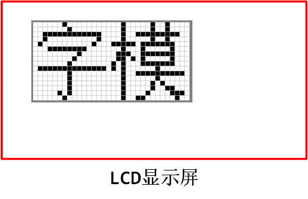

这是两个宽、高为 16x16 的像素点阵组成的两个汉字图形，其中的黑色像素点即为文字的笔迹。计算机要表示这样的图形，只需使用 16x16 个二进制
数据位，每个数据位记录一个像素点的状态，把黑色像素点以“1”表示，无色像素点以“0”表示即可。这样的一个汉字图形，使用 16x16/8=32 个字节来就可以记录下来。  16x16的“字”的字模数据以C语言数组的方式表示，见下面的代码，在这样的字模中，以两个字节表示一行像素点，16行构成一个字模。

```c
/* 字 */
unsigned char code Bmp[]=
{
    /*------------------------------------------------------------
    源文件 / 文字  : 字
    宽 × 高（像素）: 16×16
    字模格式/大小  : 单色点阵液晶字模，横向取模，字节正序/32 字节
    ----------------------------------------------------------*/
    0x02,0x00,0x01,0x00,0x3F,0xFC,0x20,0x04,0x40,0x08,0x1F,0xE0,0x00,0x40,0x00,0x80,
    0xFF,0xFF,0x7F,0xFE,0x01,0x00,0x01,0x00,0x01,0x00,0x01,0x00,0x05,0x00,0x02,0x00,
};
```

### 3. ASCII字符的点阵显示

我们可以很容易找到ASCII的C语言编码表示，我们拿linux内核源码中的字符文件 lib/fonts/font_8x16.c   来看一下吧，了解下对应关系即可：

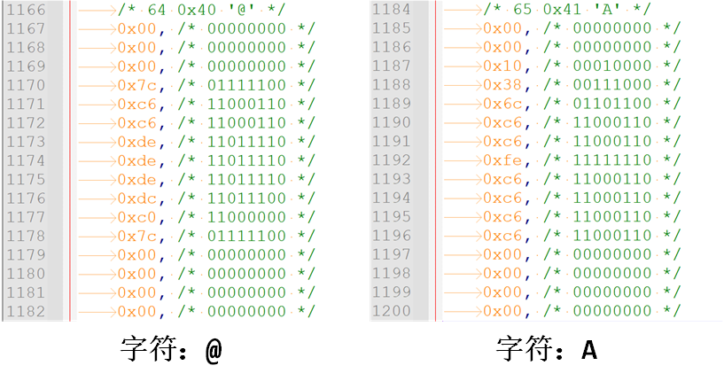

数组里的数字是如何表示点阵的？以字符 A 为例 :

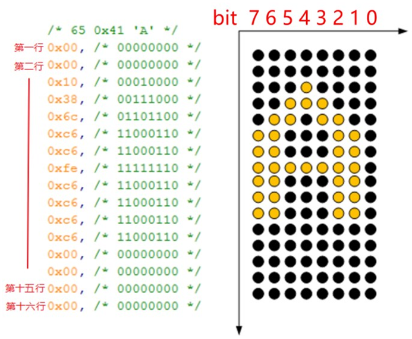

上图左侧有 16 行数值，每行 1 个字节。每一个节对应右侧一行中 8 个像素：像素从右边数起， bit0 对应第 0 个像素， bit1 对应第 1 个像素，……， bit7 对应第 7 个像素。某位的值为 1 时，表示对应的像素要被点亮；值为 0 时表示对应的像素要熄灭。  

所以要显示某个字符时，根据它的 ASCII 码在 fontdata_8x16 数组中找到它的点阵，然后取出这 16 个字节去描画 16 行像素。比如字符 A 的 ASCII 值是0x41，那么从 fontdata_8x16[0x41\*16]开始取其点阵数据。  

### 4. 字模的显示

#### 4.1 ASCII字模打印

如果使用 LCD 的画点函数，按位来扫描这些字模数据，把为 1 的位以黑色来显示 (也可以使用其它颜色)，为 0 的数据位以白色来显示，即可把整个点阵还原出来，显示在液晶屏上。  为便于理解，我们可以编写一个使用串口 printf 利用字模打印字符到串口上位机 的代码来帮助理解：

```c
void printf_Charater_8x16(void)
{
    int i, j;
    uint8_t ch;

    for ( i=0; i<16; i++) /* i 用作行计数,一共16行 */
    {
        for (j=0; j<8; j++) /*j 用作一字节内数据的移位计数, 一行像素一个字节 */
        {
            ch = fontdata_8x16[i];/* 一个数据位一个数据位地处理,先处理高位 */
            if(ch & (0x80 >> j)) // 0x80 = 1000 0000
            {
                printf("*"); // 如果最高位为 1，输出 * 号，表示笔迹
            }
            else
            {
                printf(" "); // 如果最高位为 0，输出空格，表示空白
            }

        }
        printf("\r\n"); // 输出完一行像素，换行
    }
    printf("\r\n\r\n"); // 一个字符输出完毕
}
```

字模为大写的字符 ‘ A ’：

```c
const unsigned char fontdata_8x16[] = {
	/* 65 0x41 'A' */
	0x00, /* 0000 0000 */
	0x00, /* 0000 0000 */
	0x10, /* 0001 0000 */
	0x38, /* 0011 1000 */
	0x6c, /* 0110 1100 */
	0xc6, /* 1100 0110 */
	0xc6, /* 1100 0110 */
	0xfe, /* 1111 1110 */
	0xc6, /* 1100 0110 */
	0xc6, /* 1100 0110 */
	0xc6, /* 1100 0110 */
	0xc6, /* 1100 0110 */
	0x00, /* 0000 0000 */
	0x00, /* 0000 0000 */
	0x00, /* 0000 0000 */
	0x00, /* 0000 0000 */
};
```

然后我们要是运行代码的话，会在串口调试助手看到如下图的打印：

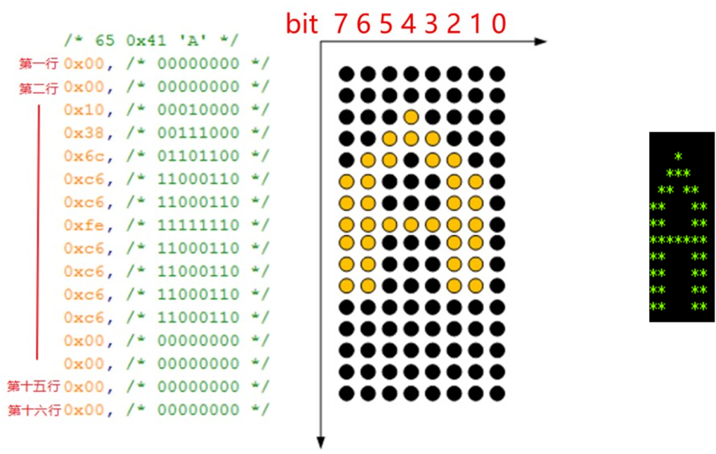

#### 4.2 中文字模打印

我们找一个中文字：“当”进行串口打印测试：

```c
void printf_Charater_chinese(void)
{
    int i, j;
    uint8_t ch;

    for ( i=0; i<16; i++) /* i 用作行计数,一共16行 */
    {
        for (j=0; j<8; j++) /*j 用作一字节内数据的移位计数, 一行像素的第一个字节 */
        {
            ch = charater_matrix[2*i];/* 一个数据位一个数据位地处理,先处理高位 */
            if(ch & (0x80 >> j)) // 0x80 = 1000 0000
            {
                printf("*"); // 如果最高位为 1，输出 * 号，表示笔迹
            }
            else
            {
                printf(" "); // 如果最高位为 0，输出空格，表示空白
            }

        }

        for (j=0; j<8; j++) /*j 用作一字节内数据的移位计数, 一行像素的第二个字节 */
        {
            ch = charater_matrix[2*i+1];/* 一个数据位一个数据位地处理,先处理高位 */
            if(ch & (0x80 >> j)) // 0x80 = 1000 0000
            {
                printf("*"); // 如果最高位为 1，输出 * 号，表示笔迹
            }
            else
            {
                printf(" "); // 如果最高位为 0，输出空格，表示空白
            }

        }

        printf("\r\n"); // 输出完一行像素，换行
    }
    printf("\r\n\r\n"); // 一个字符输出完毕
}
```

”当“字的中文字模如下，这是一个16x16的点阵大小：

```c
const unsigned char charater_matrix[] = {
    0x01,0x00, /* 0000 0001 0000 0000 */
    0x21,0x08, /* 0010 0001 0000 1000 */
    0x11,0x08, /* 0001 0001 0000 1000 */
    0x09,0x10, /* 0000 1001 0001 0000 */
    0x09,0x20, /* 0000 1001 0010 0000 */
    0x01,0x00, /* 0000 0001 0000 0000 */
    0x7F,0xF8, /* 0111 1111 1111 1000 */
    0x00,0x08, /* 0000 0000 0000 1000 */
    0x00,0x08, /* 0000 0000 0000 1000 */
    0x00,0x08, /* 0000 0000 0000 1000 */
    0x3F,0xF8, /* 0011 1111 1111 1000 */
    0x00,0x08, /* 0000 0000 0000 1000 */
    0x00,0x08, /* 0000 0000 0000 1000 */
    0x00,0x08, /* 0000 0000 0000 1000 */
    0x7F,0xF8, /* 0111 1111 1111 1000 */
    0x00,0x08, /* 0000 0000 0000 1000 */
};
```

打印效果如下：

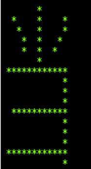

### 5. 如何制作字模？

为方便使用，需要制作所有常用字符的字模，如程序只需要英文显示，那就需要制作包含ASCII码表中所有字符的字模，如程序只需要使用一些常用汉字，则可以选择制作GB2312编码里所有字符的字模，而且希望字模数据与字符编码有固定的映射关系，以便我们在程序中使用字符编码作为索引，查找字模。

在网上搜索可找到一些制作字模的软件工具，可满足这些需求。常用的一个取模软件叫做“ PCtoLCD ”，这里以它为例说明如何制作字模，其它字模软件也是类似的。

#### 5.1 软件界面

这个软件网上一堆，好像都是免安装的，打开后界面如下：

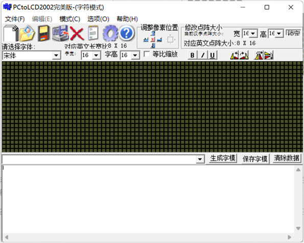

#### 5.2 配置字模格式

##### 5.2.1 设置选项卡中的设置

【打开取模软件】&rarr;【选项菜单】然后就会弹出一个对话框

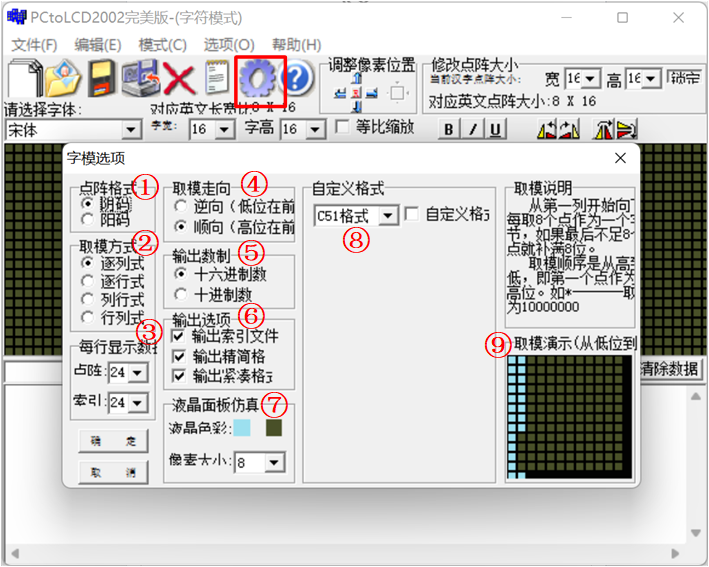

①、选项“点阵格式”中的阴、阳码是指字模点阵中有笔迹像素位的状态是“1”还是“0”，亮点表示1，熄灭表示0那种就是阴码，反过来就是阳码。我们一般使用阴码。

②、选项“取模方式”是指字模图形的扫描方向，修改这部分的设置后，选项框的右侧会有相应的说明及动画显示，这里我们把它配置成“逐行式”即可。

③、选项“每行显示的数据”里我们把点阵和索引都配置成24的话，就是设置这个点阵的像素大小为24x24。但是吧，我试过，这里的配置似乎并不能影响最终生成的字模的数据量。

④、选项取模走向就是图中的意思，决定高位和低位的先后顺序，我们一般选择顺向，即高位在前，低位在后。

⑤、输出数制就表示输出的字模是十六进制的还是十进制的，一般选择十六进制。

⑥、输出选项，这个我没改过，保持默认即可。

⑧、自定义格式表示输出的数组的风格，一般选择C51格式，也可以自定义格式。

⑨、取模演示，就表示我们当前选项设置的字模在点阵中是怎么显示的。

##### 5.2.2 主界面的设置项

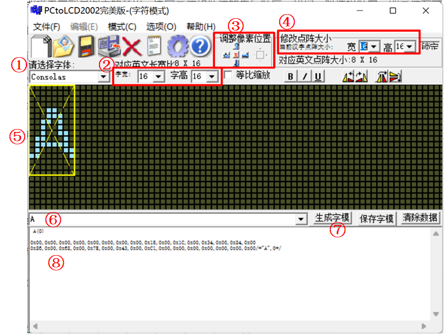

①、选择字体：这里是选择点阵中亮点的字体样式，可以选择不同的样式，不同的字体点亮的点有些许不同，但整体还是这个字。

②、这里的字宽和字高代表了字符的宽和高，也就是字模中亮点组成的字符的宽和高。

③、调整像素位置：我们生成字符的时候周围一定会有一些空行和列，我们可以在这里将字符亮点在规定点阵大小里进行平移。

④、修改点阵大小：这里是决定了最终生成的字模的点阵大小，注意这里我们可以修改的是框中的当前汉字点阵大小的宽高，它会自动对应一个对应英文点阵大小，我们可以根据这个来决定最终生成的字模的大小。

⑤、字模预览界面：图中黄色的框受④的影响，青色的亮点的字符的大小整体受到②的影响。

⑥、字符输入框：我们要生成哪个字符，就在这里输入即可，也可以生成中文的字模。

⑦、生成字模：点击这里可以生成字模。

⑧、字模数据：我们生成的字模数据将会在这里显示。

【说明】其实正常来讲，我们使用的字模都是采用ASCII的编码方式的，只占用1个字节，而汉字占据两个字节，这个区别在字模中是体现在宽这个参数上。即便GB2312又对ASCII的字符都也重新编码了（我们可以用输入法的半角打出GB2312编码的英文字符）但是我们在程序中还是使用ASCII码中的字符。所以这里字模软件设置成16x16的宽高的时候，对于ASCII中的字符来说，对应的就是8x16的ASCII字符。但是对于中文的话，就是16x16啦。

#### 5.3 生成中英文字模

我们来生成一个8x16的字符“A”和16x16的“当”的C语言字模：

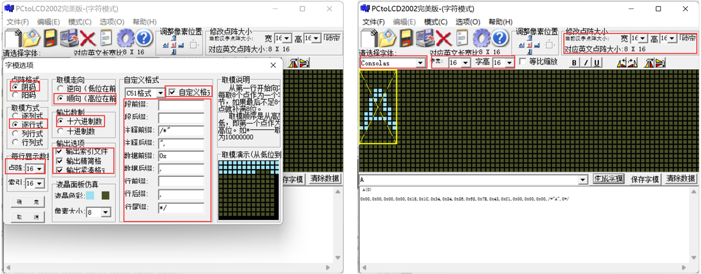

```c
 A(0)

0x00,0x00,0x00,0x00,0x18,0x1C,0x34,0x24,0x26,0x62,0x7E,0x43,0xC1,0x00,0x00,0x00,/*"A",0*/
     
 当(0)

0x01,0x00,0x21,0x08,0x11,0x08,0x09,0x10,0x09,0x20,0x01,0x00,0x7F,0xF8,0x00,0x08,
0x00,0x08,0x00,0x08,0x3F,0xF8,0x00,0x08,0x00,0x08,0x00,0x08,0x7F,0xF8,0x00,0x08,/*"当",0*/
```

我们可以将这两个字模用上边的函数打印一下，效果是一样的。

## 二、中英文字库

### 1. 汉字显示原理

前边我们已经学习过汉字的编码格式了，对汉字的编码有了一定的了解，汉字在液晶上的显示原理与前面显示字符的是一样的。汉字在液晶上的显示其实就是一些点的显示与不显示，这就相当于我们的笔一样，有笔经过的地方就画出来，没经过的地方就不画。所以要显示汉字，我们首先要知道汉字的点阵数据，这些数据可以由专门的软件来生成。只要知道了一个汉字点阵的生成方法，那么我们在程序里面就可以把这个点阵数据解析成一个汉字。

知道显示了一个汉字，就可以推及整个汉字库了。汉字在各种文件里面的存储不是以点阵数据的形式存储的（否则那占用的空间就太大了），而是以内码的形式存储的，就是GB2312/GBK/BIG5 等这几种的一种，每个汉字对应着一个内码，在知道了内码之后再去字库里面查找这个汉字的点阵数据，然后在液晶上显示出来。这个过程我们是看不到，但是计算机是要去执行的。  

单片机要显示汉字也与此类似：汉字内码（GBK/GB2312）&rarr;查找点阵库&rarr;解析&rarr;显示。  

所以只要我们有了整个汉字库的点阵，就可以把电脑上的文本信息在单片机上显示出来了。这里我们要解决的最大问题就是制作一个与汉字内码对得上号的汉字点阵库。而且要方便单片机的查找。每个 GBK 码由 2 个字节组成，第一个字节为 0X81~0XFE，第二个字节分为两部分，一是 0X40~0X7E，二是 0X80~0XFE。其中与 GB2312 相同的区域，字完全相同。  

#### 1.1 GBK寻址公式

我们把第一个字节代表的意义称为区，那么 GBK 里面总共有 126 个区（0XFE-0X81+1），每个区内有 190 个汉字（0XFE-0X80+0X7E-0X40+2），总共就有 126\*190=23940 个汉字（我们可以参考这里：[GBK 编码范围, GBK 编码表 (qqxiuzi.cn)](https://www.qqxiuzi.cn/zh/hanzi-gbk-bianma.php)）。我们的点阵库只要按照这个编码规则从 0X8140 开始，逐一建立，每个区的点阵大小为每个汉字所用的字节数\*190。这样，我们就可以得到在这个字库里面定位汉字的方法：  

```c
当 GBKL<0X7F 时： Hp=((GBKH-0x81)*190+GBKL-0X40)*(size*2)；
当 GBKL>0X80 时： Hp=((GBKH-0x81)*190+GBKL-0X41)*(size*2)；
```

其中 GBKH、 GBKL 分别代表 GBK 的第一个字节和第二个字节(也就是高位和低位)，size 代表汉字字体的大小（比如 16 字体， 12 字体等）， Hp 则为对应汉字点阵数据在字库里面的起始地址(假设是 从 0 开始存放)。  

#### 1.2 GB2312寻址公式

使用字模软件制作的字模数据一般会按照编码格式排列。根据GB2312的区位码表，任意字符的寻址公式如下：

```c
Addr = (((CodeH-0xA0-1)*94) +(CodeL-0xA0-1))*16*16/8
```

其中CodeH和CodeL分别是GB2312编码的第一字节和第二字节；94是指一个区中有94个位(即94个字符)。公式的实质是根据字符的GB2312编码，求出区位码，然后区位码乘以每个字符占据的字节数，求出地址偏移。

### 2. 字库制作

我们可以使用上边介绍的 PCtoLCD来生成中文字库，我们点击这个作业本一样的标记，会打开一个选项卡：

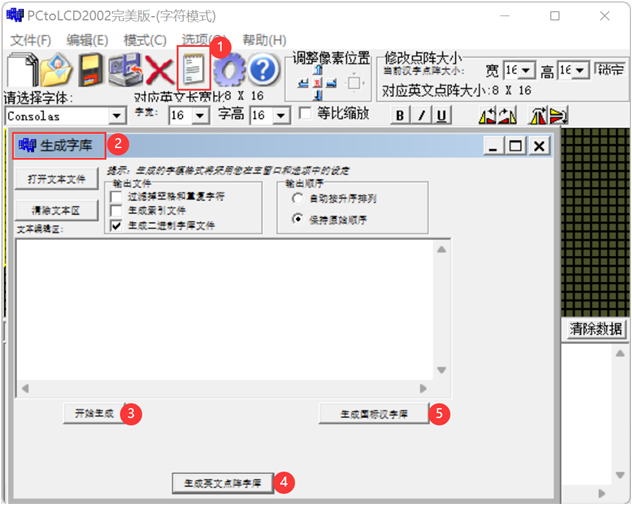

①、点击这个图标就会打开下边的选项卡。

②、这个就是生成字库的选项卡。

③、开始生成：这种方式需要我们自己在文本编辑区输入汉字或者字符，或者是通过上边的按钮打开文本文件，字符或者中文汉字可以写在一个文件中。

④、生成英文点阵字库：这种方式会自动生成**所有**的英文对应的字模。

⑤、生成国标汉字库：这里会生成GB2312国标的汉字库对应的字模。

【注意】

（1）这里生成的字库都会使用我们在主界面以及设置选项卡进行的设置。

（2）网上还有很多生成字模的软件，有一些甚至可以选择中文的编码类型，这个 PCtoLCD 好像只能成成GB2312编码的中文字库。

（3）生成的所有英文的字模其实有很多使我们不需要使用的，这个时候我们可以在上边界面勾选生成索引文件，然后在索引文件中不需要的字符给删掉，然后重新使用③这种方式打开修改后的索引文件，然后点击开始生成，使用修改后的索引文件生成字模库。

（4）由于英文的字库还是比较小的，我们其实可以将生成的字库数据拷贝出来处理一下，然后写成数组，直接在程序中使用，但是中文字库就最好不要这样做了，我们其实可以看一下生成的16x16的中文字库，大概有200多KB，我们的STM32倒是可以放下，但是毕竟还要放其他的东西，而且毕竟内部Flash也就只有512KB，都是极为珍贵的资源，随意最好就是将中文字库放在其他地方，比如EEPROM，外部FLASH或者SD卡等，需要使用的时候到这些存储器中去读。

## 三、英文字符显示实现

注意下边使用的字库的配置都是这样的：

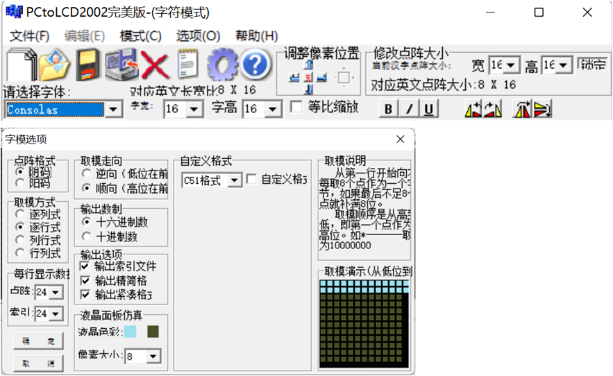

### 1. 英文字库

我们使用PCtoLCD生成一个所有英文的字库：


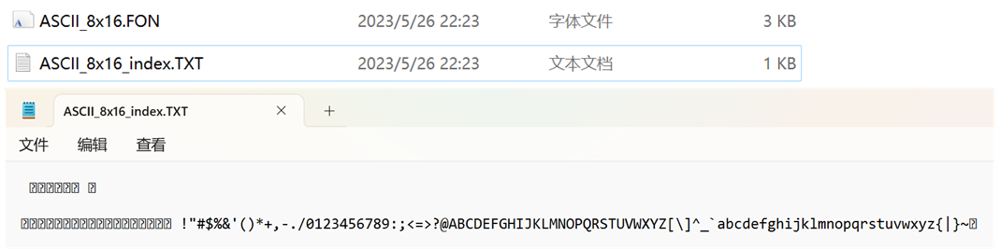

下边记事本打开的就是生成的索引文件，它与上边的.FON二进制文件中表示的字符是一一对应的，但是其实我们使用的英文字符从空格开始就行了，前边的那些我们根本用不到，所以我们可以把前边的那些删掉，然后通过文件重新生成一个字库，要注意保留开头的空格，毕竟空格也是我们需要显示的字符之一：

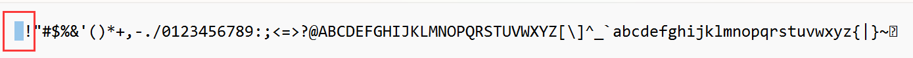

然后我们打开这个二进制文件，我使用的是VScode+Hex Editor插件打开的，将显示设置为16个字节，这样由于我们生成的是8x16的点阵字库，所以这样的话每一行就对应这一个英文字符啦。

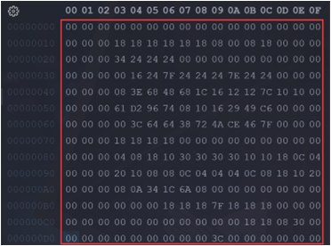

当我们使用文件系统，或者说将其存储到存储介质中的话，我们不用对文件做任何操作，将其写入到存储介质，然后读对应位置的数据即可，可是我们要是想将这些英文点阵数据直接写到C语言文件的话，我们需要将其做成一个数组，这样我闷酒需要将这些数据前边加上0x，并且要在每个字节后加一个逗号来分割，这个时候其实我们用VSCode或者Notepad++都不好用，可以使用Sublime Text这个软件来操作，主要是因为它可以直接将二进制文件拖拽过来然后复制粘贴，我们按下Ctrl+a选中所有，然后Ctrl+Shift+l就可以进入列编辑，这样就可以很方便的添加0x和逗号啦，然后再将修改后的数据复制到程序的数组中就可以啦。

### 2. 映射关系

我们这里以上边改完后的C语言数组为例进行分析。在显示前，首先要提取出字符相应的字模数据。由于ASCII 码中的编码 0~31(NULL~US 符号) 是不存在图形表示的，为节省空间，字模表中只包含图形符号相关的数据：


例如，对于8x16 的字模表，每个字符的字模数据长度就是8\*16/8=16 字节，那么 0~15 字节表示的是’空格’的字模， 16~31 字节表示的是’ ! ’号的字模， 32~47 字节表示的是 “ （双引号）号的字模。  

因此，我们获取要显示的字符后，用这个字符的ASCII码减去空格的ASCII码，就得到了这个字符在字符索引中的偏移量，再用这个偏移量乘以单个字模的字节数，这样就可以得到要显示的字符的字模在字模表中的起始位置。

```c
偏移量         = 要显示的字符 - ' '
单个字模大小    = 宽 x 高 / 8
字模数据起始位置 = 偏移量 x 单个字模大小
    
字模位置: (character-' ')*(宽x高/8)
```

举个例子：我们现在计算一下字符 “ A ” 的字模的位置：

```c
偏移量         = 'A' - ' '  = 0x41 - 0x20 = 65 - 32 = 33
单个字模大小    = 8 x 16 / 8 = 16 字节
字模数据起始位置 = 33 * 16 = 528
```

我们看一下它在字模表中的位置，528的话二进制就是210，我们在VSCode中看一下左侧地址为210的位置：


```c
unsigned char fontdata_8x16[]=
{0x00, 0x00, 0x00, 0x00, 0x18, 0x1c, 0x34, 0x24, 0x26, 0x62, 0x7e, 0x43, 0xc1, 0x00, 0x00, 0x00};
```

然后我们用上边的printf打印函数打印一下这组数据，会看到如下显示：

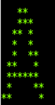

这个跟上边显示的不太一样，大概就是字体的问题，不过可以看到这样是定位到了字模的位置了。

### 3. ASCII显示实现

```c
/**
  * @brief  在 LCD 上显示一个英文字符
  * @note   可使用LCD_SetBackColor、LCD_SetTextColor、LCD_SetColors函数设置颜色
  * @param  usX 在特定扫描方向下字符的起始X坐标
  * @param  usY 在特定扫描方向下该点的起始Y坐标
  * @param  cChar 要显示的英文字符 
  * @retval 
  */
void LCD_ShowChar(uint16_t usX, uint16_t usY, const char cChar)
{
    uint8_t byteCount, bitCount, fontLength;
    uint16_t ucRelativePositon;
    uint8_t *Pfont;

    // 对ascii码表偏移（字模表不包含ASCII表的前32个非图形符号）
    ucRelativePositon = cChar - ' ';

    // 每个字模的字节数
    fontLength = (lcd_param.LCD_Currentfonts->Width * lcd_param.LCD_Currentfonts->Height) / 8;

    // 字模首地址
    /*ascii码表偏移值乘以每个字模的字节数，求出字模的偏移位置*/
    Pfont = (uint8_t *)&(lcd_param.LCD_Currentfonts->table[ucRelativePositon * fontLength]);

    // 设置显示窗口
    ILI9341_OpenWindow(usX, usY, lcd_param.LCD_Currentfonts->Width, lcd_param.LCD_Currentfonts->Height);

    ILI9341_Write_Cmd(CMD_SetPixel);

    // 按字节读取字模数据
    // 由于前面直接设置了显示窗口，显示数据会自动换行
    for (byteCount = 0; byteCount < fontLength; byteCount++)
    {
        // 一位一位处理要显示的颜色
        for (bitCount = 0; bitCount < 8; bitCount++)
        {
            if (Pfont[byteCount] & (0x80 >> bitCount))
                ILI9341_Write_Data(lcd_param.PonitColor);
            else
                ILI9341_Write_Data(lcd_param.BackColor);
        }
    }
}
```

## 四、中文字符显示实现

注意下边使用的字库的配置都是这样的：


### 1. 中文字库

我们同样使用PCtoLCD生成一个所有GB2312编码的中文字库：

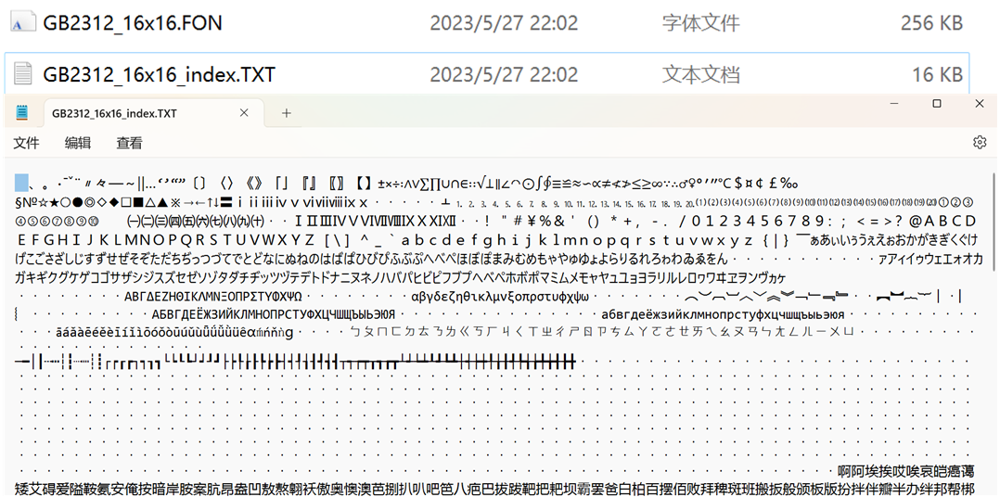

下边的是我用记事本打开的字库的索引文件，后缀为.FON的为GB2312的字模文件，里边的字模也都是按照下方索引的方式进行排列的。可以看到中文字库直接256KB，要是放到内部Flash的话，直接一般空间就没得了，所以一般我们会使用EEPROM、外部FLASH或者SD卡等存储中文字库。

我们来看一下生成的字库文件，我们每行显示16个字节，我们使用的是16x16大小的点阵，一个汉字也是实际占据了这16x16个点阵位置，所以一个汉字在这里就需要有16x16/8=32个字节，就是框中的这两行就表示一个汉字，根据索引文件，这32个字节应该是全角的空格。

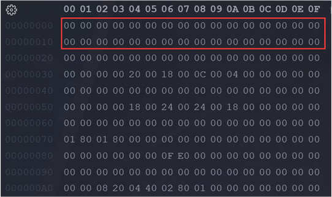

### 2. 映射关系

#### 2.1 GB2312编码回顾

前边我们知道，GB2312编码的时候，当2个大于127的字符连在一起时，就表示1个汉字，第1个字节使用 (0xA1-0xFE) 编码，第2个字节使用(0xA1-0xFE)编码，这样的编码组合起来可以表示了7000多个符号，其中包含6763个汉字。在 GB2312 编码的实际使用中，对所收录字符进行了“分区”处理，共94个区，每区含有94个位，共8836个码位。我们可以参考这里：[GB2312 编码范围, GB2312 编码表 (qqxiuzi.cn)](https://www.qqxiuzi.cn/zh/hanzi-gb2312-bianma.php)

为兼容ASCII码，区号和位号分别加上0xA0偏移就得到GB2312编码。在区位码上加上0xA0偏移，可求得GB2312编码范围：0xA1A1－0xFEFE，其中汉字的编码范围为0xB0A1-0xF7FE，第一字节0xB0-0xF7（对应区号：16－87），第二个字节0xA1-0xFE（对应位号：01－94）。那么我们现在有了一个汉字，我们怎么在字库中找到表示它的字模数据的起始呢？

#### 2.2 在单片机中的汉字

##### 2.2.1 乱码了？

我们先来看一下中文在单片机中是怎样的，我们通过printf打印一个汉字的十六进制：

```c
uint8_t ch[] = "中";
for (int i = 0; i < sizeof(ch)/sizeof(ch[0]); i++)
{
    printf("0x%x ", ch[i]);
}
printf("\r\n");
```

这样，我们会得到这样的输出

```c
0xe4 0xb8 0xad 0x0
```

为什么有四个？一个汉字不是俩字节嘛，最后的'\\0'是肯定有的，那ad哪来的？我们去网页查一下 “ 中 ” 字的编码：

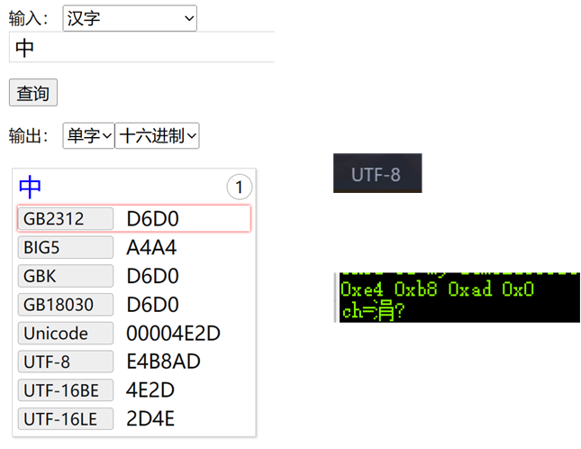

发现，怎么是UTF-8的编码啊，原来我使用的VScode创建的C语言文件，默认就是UTF-8编码的，但是为什么打印出来会乱码呢？网上查了一下，基本没查到，都是在说吧编码格式改成GB2312就可以了，暂时没见哪个说原理的，不过我猜测就是，我们使用UTF-8的格式来编码C语言文件，所以上边的"中"字就也是按UTF-8来编码的，所以编译器也把它当成是UTF-8，但是串口调试助手支持的中文显示是GB2312的，这样编码格式不一样，就导致了串口调试助手显示乱码。我们可以验证一下，我们用记事本创建一个UTF-8编码的文件，里边输入一个“中”字，然后通过Notepad++打开，然后转换编码格式为GB2312：

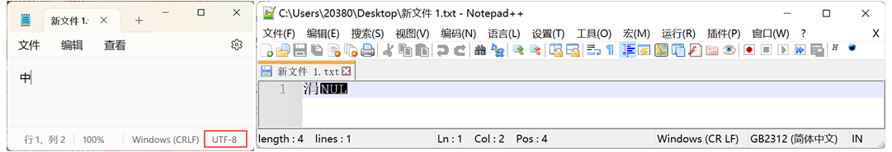

这样一看，乱码显示的字符一致，大概可以验证我们的猜想。

##### 2.2.2 GB2312文件

那我们将C文件编码格式改成GB2312，然后打印一下再看看，由于我之前写了很多中文注释，所以这里一旦更改编码格式，就很多乱码出现了，所以我们可以重新定义一个C文件，直接将编码格式改为GB2312，然后将这个数组定义到新的源文件，然后再调用：

```c
// GB2312编码的文件中定义ch数组
unsigned char ch[3] = "中";
for (int i = 0; i < 3; i++)
{
    printf("0x%x ", ch[i]);
}
printf("\r\n");
printf("ch=%s\r\n", ch);
```

然后我们就会得到如下打印啦：

```c
0xd6 0xd0 0x0 
ch=中
```

这样就对啦，其中前两个字节表示的是“中”字的编码，我们“中”字的编码完整的应该是0xd6d0，这样就跟我们查询到的编码值一样啦。

#### 2.3 寻址公式的来历

前边我们说到有一个寻址公式：

```c
Addr = (((CodeH-0xA0-1)*94) +(CodeL-0xA0-1))*宽*高/8
```

这个公式怎么来的呢？首先我们来看一下区码表（参考这个[GB2312 编码范围, GB2312 编码表 (qqxiuzi.cn)](https://www.qqxiuzi.cn/zh/hanzi-gb2312-bianma.php)）：

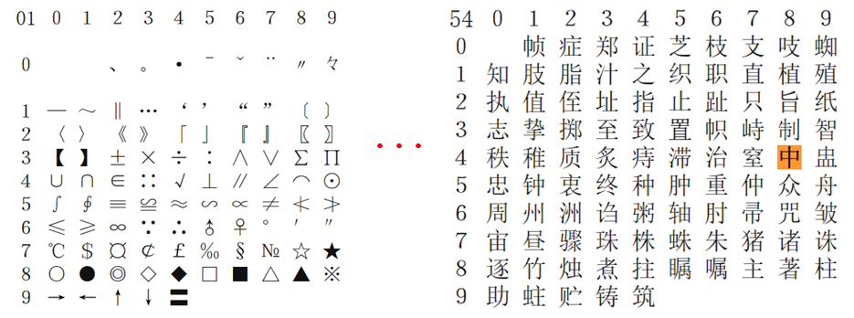

我们可以知道每一个区有94个中文字符，我们要是确定了一个字符的区码和位码，就确定了这个字符的位置，也就可以确认字符在生成的字库索引文件中的位置啦。如下计算公式，GB2312编码范围是A1A1－FEFE，其中汉字的编码范围为B0A1-F7FE，第一字节0xB0-0xF7（对应区号：16－87），第二个字节0xA1-0xFE（对应位号：01－94）。**注意**这个B0对应的区号是16，而它的值减去A1的话是15，原因在于区号从01开始编，而不是从00开始的。位码也是一样从01开始的。

```c
区码: 高位字节-0xA1 
位码: 低位字节-0xA1
```

我们以这个“中”为例，编码为D6D0，那么：

```c
区号 = 0xD6-0xA1 = 0x35 = 53
位号 = 0xD0-0xA1 = 0x2F = 47
```

我们发现似乎不对啊，怎么都少了1呢？原因就是GB2312区码从01开始，所以要再加01，位码也是从01开始，所以也要加01，所以，最后我们就得到这样一个计算公式，这样可以得到这个汉字在区码表中的详细位置：

```c
区码: 高位字节-0xA1+0x01 
位码: 低位字节-0xA1+0x01
```

但是我们编写程序一般还是都从0开始，不管是**数组还是从存储器读取，起始地址都是按0来计算**，所以后边的01就不用加了，只要对应的上就行，单个字模的大小就是宽x高/8个字节，所以最后得到的公式就是：

```c
Addr = (((CodeH-0xA0-1)*94) +(CodeL-0xA0-1))*宽*高/8
```

比如说上边的中，我们这样计算一下：

```c
Addr = (((0xD6-0xA0-1)*94) +(0xD0-0xA0-1))*16*16/8 
     = (53*94+47)*32
     = 160928 
     = 0x274A0
```

我们看一下在字库的这个地址的数据：

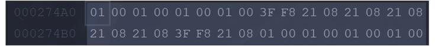

我们转化成数组，用上边中文字模打印函数来打印一下这个字模，看一看是不是预想的样子：

```c
unsigned char charater_matrix[]=
{
  0x01, 0x00, 0x01, 0x00, 0x01, 0x00, 0x01, 0x00, 0x3F, 0xF8, 0x21, 0x08, 0x21, 0x08, 0x21, 0x08, 
  0x21, 0x08, 0x21, 0x08, 0x3F, 0xF8, 0x21, 0x08, 0x01, 0x00, 0x01, 0x00, 0x01, 0x00, 0x01, 0x00
};
```

然后我们就会在串口看到这样的信息：


说明我们的计算方式是正确的。

### 3. 汉字显示实现

这里我就没有测试了，因为我的测试工程全都是UTF-8编码，而且我还写了大量的注释，重写一个测试工程感觉没必要。注意汉字显示的时候要用到EEPROM、外部FLASH或者SD卡来存储字库，需要实现对应的读写函数。

#### 3.1 相关的宏

```c
/* 在显示屏上显示的字符大小 */
#define WIDTH_CH_CHAR  16	         // 中文字符宽度 
#define HEIGHT_CH_CHAR 16		     // 中文字符高度 
```

#### 3.2 获取字模数据

```c
/**
  * @brief  获取FLASH中文显示字库数据
  * @note   
  * @param  pBuffer 存储字库矩阵的缓冲区
  * @param  c 要获取的文字
  * @retval 
  */
int GetGBKCode_from_EXFlash(uint8_t *pBuffer, uint16_t c)
{
  unsigned char High8bit, Low8bit;
  unsigned int pos;

  static uint8_t everRead = 0;

  /*第一次使用，初始化FLASH*/
  if (everRead == 0)
  {
    SPI_FLASH_Init();
    everRead = 1;
  }

  High8bit = c >> 8;    /* 取高8位数据 */
  Low8bit = c & 0x00FF; /* 取低8位数据 */

  /*GB2312 公式*/
  pos = ((High8bit - 0xa1) * 94 + Low8bit - 0xa1) * WIDTH_CH_CHAR * HEIGHT_CH_CHAR / 8;
  SPI_FLASH_BufferRead(pBuffer, GBKCODE_START_ADDRESS + pos, WIDTH_CH_CHAR * HEIGHT_CH_CHAR / 8); // 读取字库数据
  //	  printf ( "%02x %02x %02x %02x\n", pBuffer[0],pBuffer[1],pBuffer[2],pBuffer[3]);

  return 0;
}
```


#### 3.3 显示汉字

```c
/**
  * @brief  在 LCD 上显示一个中文字符
  * @note   可使用LCD_SetBackColor、LCD_SetTextColor、LCD_SetColors函数设置颜色
  * @param  usX 在特定扫描方向下字符的起始X坐标
  * @param  usY 在特定扫描方向下字符的起始Y坐标
  * @param  usChar 要显示的中文字符（国标码） 
  * @retval 
  */
void LCD_ShowChar_CH(uint16_t usX, uint16_t usY, uint16_t usChar)
{
    uint8_t rowCount, bitCount;
    uint8_t ucBuffer[WIDTH_CH_CHAR * HEIGHT_CH_CHAR / 8];
    uint16_t usTemp;

    // 设置显示窗口
    ILI9341_OpenWindow(usX, usY, WIDTH_CH_CHAR, HEIGHT_CH_CHAR);

    ILI9341_Write_Cmd(CMD_SetPixel);

    // 取字模数据
    GetGBKCode(ucBuffer, usChar);

    for (rowCount = 0; rowCount < HEIGHT_CH_CHAR; rowCount++)
    {
        /* 取出两个字节的数据，在lcd上即是一个汉字的一行 */
        usTemp = ucBuffer[rowCount * 2];
        usTemp = (usTemp << 8);
        usTemp |= ucBuffer[rowCount * 2 + 1];

        for (bitCount = 0; bitCount < WIDTH_CH_CHAR; bitCount++)
        {
            if (usTemp & (0x8000 >> bitCount)) // 高位在前
                ILI9341_Write_Data(lcd_param.PonitColor);
            else
                ILI9341_Write_Data(lcd_param.BackColor);
        }
    }
}
```

如果另外制作使用比如32\*32字模 需在 LCD_ShowChar_CH函数内需改取字节数据过程为对应字节个数，取出4个字节的数据，在lcd上即是一个汉字的一行:

```c
usTemp = ucBuffer [ rowCount * 4 ];
usTemp = ( usTemp << 8 );
usTemp |= ucBuffer [ rowCount * 4 + 1 ];
usTemp = ( usTemp << 8 );
usTemp |= ucBuffer [ rowCount * 4 + 2 ];
usTemp = ( usTemp << 8 );
usTemp |= ucBuffer [ rowCount * 4 + 3 ];
```

### 4. 字库怎么写入得？

其实写入字库的话，我们是需要有文件系统的，因为我们并不能提前把数据写入到EEPROM或者外部FLASH，当然可能也有，我不知道罢了。现在我见的方法就是将字库放到SD卡，然后从SD卡读取后再写入到这些非易失性存储器中，只要写入一次，不擦除的话，后边就可以一直使用啦。

那怎么从SD卡写入到其他的ROM中？我们需要使用到文件系统，就是前边学的FatFs。我们将SD卡插在电脑，将这些字库文件拷贝到SD卡，然后再将SD卡插回单片机，这样我们就可以挂载SD卡到单片机，再通过FatFs加载这些文件，读取文件数据到内存，然后再写入到EEPROM或者外部FLASH啦。
