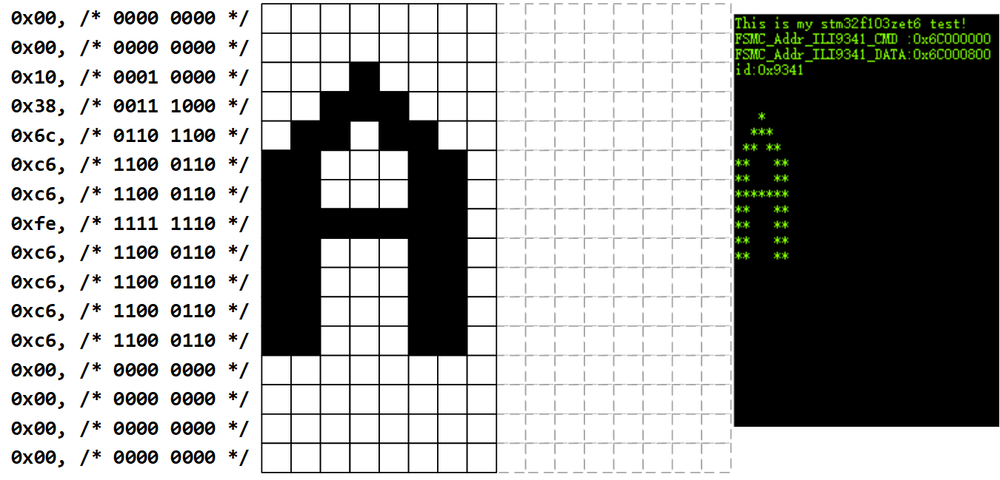
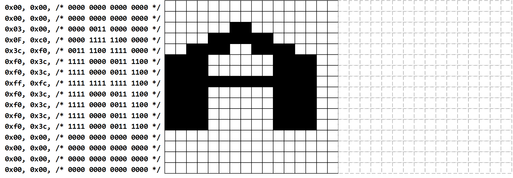
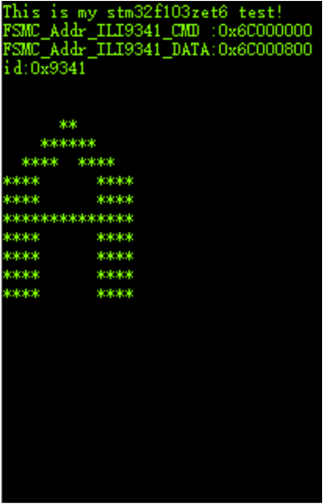
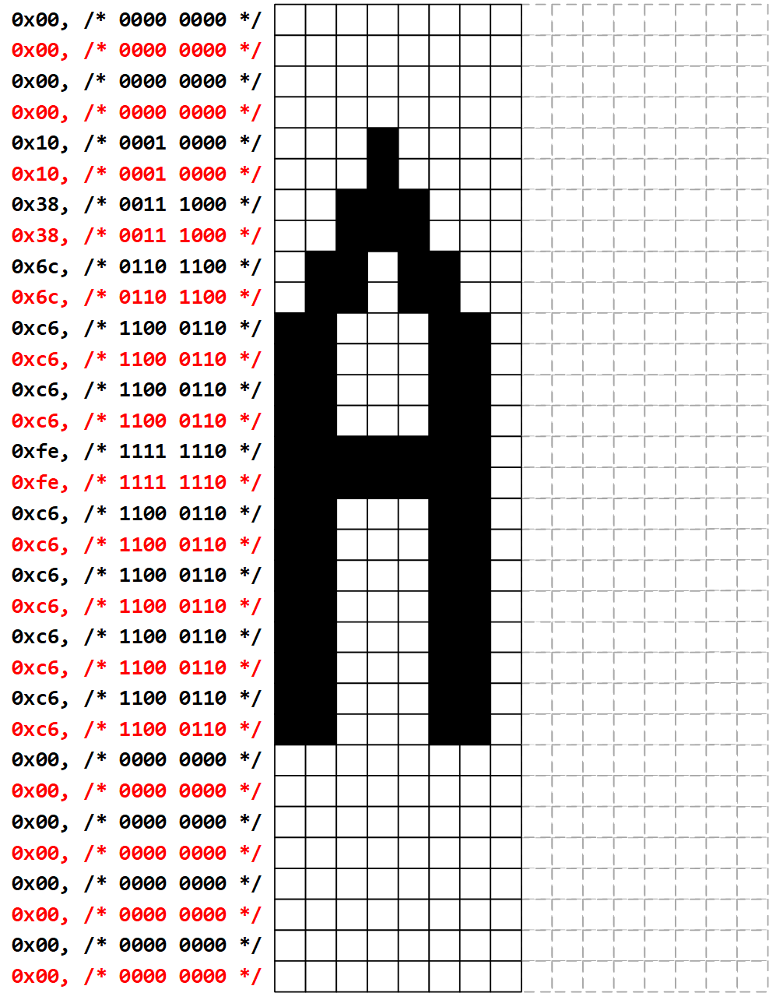
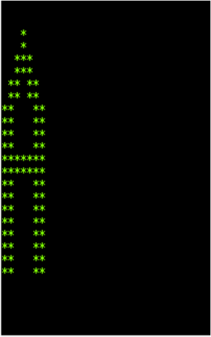
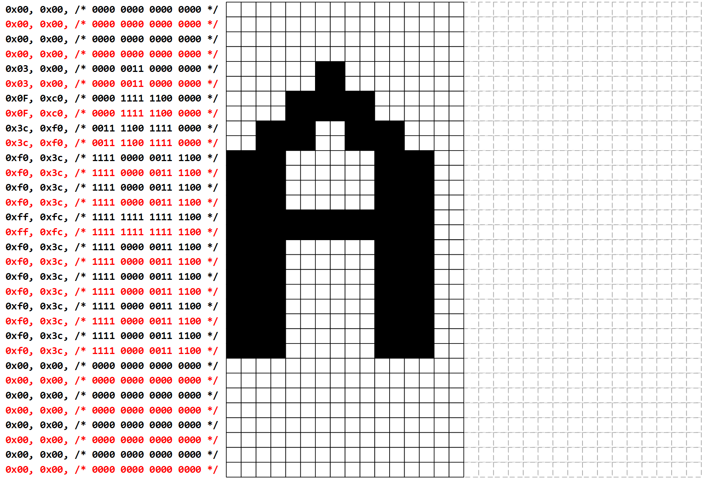
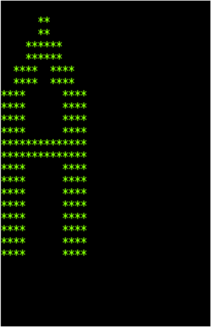

<!-- more -->

我们要是想显示不同大小的字符怎么办？重新生成不同大小的字模？这当然是可以的啦，但是吧，要是需要的大小有很多怎么办，比如说我们需要16x16的，32x32的，64x64的，......，这样的话，都生成数组，然后放在文件里嘛，中文也都做成字库嘛？这样其实是可以的，只要内存足够就行，但是这样其实是很浪费资源的，它们的字模都是一样的，但是仅仅就是大小不同，我们就不能用一张表，然后对字体进行缩放，得到其他大小的字模嘛？当然可以啦，下边就来学习一下这个字模缩放的流程啦。

注意后边主要是以英文字模的缩放为例，来说明缩放的原理，我们使用的字模大小为宽16高16，对应到英文的话，就是宽8高16啦。

## 一、基本原理

其实对于字模缩放来说，基本原理很简单，我们以之前从linux内核源码中复制出来的8x16的字模 "A"为例。

### 1. 原字模数据

#### 1.1 字模数组

它对应的字模数组为：

```c
uint8_t fontdata_8x16[] = {
	/* 65 0x41 'A' */
	0x00, /* 0000 0000 */
	0x00, /* 0000 0000 */
	0x10, /* 0001 0000 */
	0x38, /* 0011 1000 */
	0x6c, /* 0110 1100 */
	0xc6, /* 1100 0110 */
	0xc6, /* 1100 0110 */
	0xfe, /* 1111 1110 */
	0xc6, /* 1100 0110 */
	0xc6, /* 1100 0110 */
	0xc6, /* 1100 0110 */
	0xc6, /* 1100 0110 */
	0x00, /* 0000 0000 */
	0x00, /* 0000 0000 */
	0x00, /* 0000 0000 */
	0x00, /* 0000 0000 */
};
```

#### 1.2 打印函数

```c
void printf_Charater_8x16(void)
{
    int i, j;
    uint8_t ch;

    for ( i=0; i<16; i++) /* i 用作行计数,一共16行 */
    {
        for (j=0; j<8; j++) /*j 用作一字节内数据的移位计数, 一行像素一个字节 */
        {
            ch = fontdata_8x16[i];/* 一个数据位一个数据位地处理,先处理高位 */
            if(ch & (0x80 >> j)) // 0x80 = 1000 0000
            {
                printf("*"); // 如果最高位为 1，输出 * 号，表示笔迹
            }
            else
            {
                printf(" "); // 如果最高位为 0，输出空格，表示空白
            }

        }
        printf("\r\n"); // 输出完一行像素，换行
    }
    printf("\r\n\r\n"); // 一个字符输出完毕
}
```

#### 1.3 打印效果



### 2. 横向放大2倍

#### 2.1 基本原理

我们想要横向放大两倍，那么我们可以采用这样的方式，我们将每一列，都复制一列，然后填充到这一列的后一列：



#### 2.2 字模数组

```c
uint8_t fontdata_16x16[] = {
	0x00, 0x00, /* 0000 0000 0000 0000 */
	0x00, 0x00, /* 0000 0000 0000 0000 */
	0x03, 0x00, /* 0000 0011 0000 0000 */
	0x0F, 0xc0, /* 0000 1111 1100 0000 */
	0x3c, 0xf0, /* 0011 1100 1111 0000 */
	0xf0, 0x3c, /* 1111 0000 0011 1100 */
	0xf0, 0x3c, /* 1111 0000 0011 1100 */
	0xff, 0xfc, /* 1111 1111 1111 1100 */
	0xf0, 0x3c, /* 1111 0000 0011 1100 */
	0xf0, 0x3c, /* 1111 0000 0011 1100 */
	0xf0, 0x3c, /* 1111 0000 0011 1100 */
	0xf0, 0x3c, /* 1111 0000 0011 1100 */
	0x00, 0x00, /* 0000 0000 0000 0000 */
	0x00, 0x00, /* 0000 0000 0000 0000 */
	0x00, 0x00, /* 0000 0000 0000 0000 */
	0x00, 0x00, /* 0000 0000 0000 0000 */
};
```

#### 2.3 打印函数

```c
void printf_Charater_16x16(void)
{
    int i, j;
    uint16_t ch;

    for ( i=0; i<16; i++) /* i 用作行计数,一共16行 */
    {
        for (j=0; j<16; j++) /*j 用作一字节内数据的移位计数, 一行像素一个字节 */
        {
            ch = fontdata_16x16[2*i];
            ch = ch << 8;
            ch |= fontdata_16x16[2*i+1];
            if(ch & (0x8000 >> j)) // 0x8000 = 1000 0000 0000 0000
            {
                printf("*"); // 如果最高位为 1，输出 * 号，表示笔迹
            }
            else
            {
                printf(" "); // 如果最高位为 0，输出空格，表示空白
            }

        }
        printf("\r\n"); // 输出完一行像素，换行
    }
    printf("\r\n\r\n"); // 一个字符输出完毕
}
```

#### 2.4 打印效果



### 3. 纵向放大2倍

#### 3.1 基本原理

与横向放大类似，只是每行往下一行复制一行，行数加一倍：



#### 3.2 字模数组

```c
uint8_t fontdata_8x32[] = {
	/* 65 0x41 'A' */
	0x00, /* 0000 0000 */
	0x00, /* 0000 0000 */
	0x00, /* 0000 0000 */
	0x00, /* 0000 0000 */
	0x10, /* 0001 0000 */
	0x10, /* 0001 0000 */
	0x38, /* 0011 1000 */
	0x38, /* 0011 1000 */
	0x6c, /* 0110 1100 */
	0x6c, /* 0110 1100 */
	0xc6, /* 1100 0110 */
	0xc6, /* 1100 0110 */
	0xc6, /* 1100 0110 */
	0xc6, /* 1100 0110 */
	0xfe, /* 1111 1110 */
	0xfe, /* 1111 1110 */
	0xc6, /* 1100 0110 */
	0xc6, /* 1100 0110 */
	0xc6, /* 1100 0110 */
	0xc6, /* 1100 0110 */
	0xc6, /* 1100 0110 */
	0xc6, /* 1100 0110 */
	0xc6, /* 1100 0110 */
	0xc6, /* 1100 0110 */
	0x00, /* 0000 0000 */
	0x00, /* 0000 0000 */
	0x00, /* 0000 0000 */
	0x00, /* 0000 0000 */
	0x00, /* 0000 0000 */
	0x00, /* 0000 0000 */
	0x00, /* 0000 0000 */
	0x00, /* 0000 0000 */
};
```

#### 3.3 打印函数

```c
void printf_Charater_8x32(void)
{
    int i, j;
    uint8_t ch;

    for ( i=0; i<32; i++) /* i 用作行计数,一共32行 */
    {
        for (j=0; j<8; j++) /*j 用作一字节内数据的移位计数, 一行像素一个字节 */
        {
            ch = fontdata_8x32[i];/* 一个数据位一个数据位地处理,先处理高位 */
            if(ch & (0x80 >> j)) // 0x80 = 1000 0000
            {
                printf("*"); // 如果最高位为 1，输出 * 号，表示笔迹
            }
            else
            {
                printf(" "); // 如果最高位为 0，输出空格，表示空白
            }

        }
        printf("\r\n"); // 输出完一行像素，换行
    }
    printf("\r\n\r\n"); // 一个字符输出完毕
}
```

#### 3.4 打印效果



### 4. 整体放大2倍

#### 4.1 基本原理

整体放大的原理与上边类似，只是综合了横向放大和纵向放大：



#### 4.2 字模数组

```c
uint8_t fontdata_16x32[] = {
	0x00, 0x00, /* 0000 0000 0000 0000 */
	0x00, 0x00, /* 0000 0000 0000 0000 */
	0x00, 0x00, /* 0000 0000 0000 0000 */
	0x00, 0x00, /* 0000 0000 0000 0000 */
	0x03, 0x00, /* 0000 0011 0000 0000 */
	0x03, 0x00, /* 0000 0011 0000 0000 */
	0x0f, 0xc0, /* 0000 1111 1100 0000 */
	0x0f, 0xc0, /* 0000 1111 1100 0000 */
	0x3c, 0xf0, /* 0011 1100 1111 0000 */
	0x3c, 0xf0, /* 0011 1100 1111 0000 */
	0xf0, 0x3c, /* 1111 0000 0011 1100 */
	0xf0, 0x3c, /* 1111 0000 0011 1100 */
	0xf0, 0x3c, /* 1111 0000 0011 1100 */
	0xf0, 0x3c, /* 1111 0000 0011 1100 */
	0xff, 0xfc, /* 1111 1111 1111 1100 */
	0xff, 0xfc, /* 1111 1111 1111 1100 */
	0xf0, 0x3c, /* 1111 0000 0011 1100 */
	0xf0, 0x3c, /* 1111 0000 0011 1100 */
	0xf0, 0x3c, /* 1111 0000 0011 1100 */
	0xf0, 0x3c, /* 1111 0000 0011 1100 */
	0xf0, 0x3c, /* 1111 0000 0011 1100 */
	0xf0, 0x3c, /* 1111 0000 0011 1100 */
	0xf0, 0x3c, /* 1111 0000 0011 1100 */
	0xf0, 0x3c, /* 1111 0000 0011 1100 */
	0x00, 0x00, /* 0000 0000 0000 0000 */
	0x00, 0x00, /* 0000 0000 0000 0000 */
	0x00, 0x00, /* 0000 0000 0000 0000 */
	0x00, 0x00, /* 0000 0000 0000 0000 */
	0x00, 0x00, /* 0000 0000 0000 0000 */
	0x00, 0x00, /* 0000 0000 0000 0000 */
	0x00, 0x00, /* 0000 0000 0000 0000 */
	0x00, 0x00, /* 0000 0000 0000 0000 */
};
```

#### 4.3 打印函数

```c
void printf_Charater_16x32(void)
{
    int i, j;
    uint16_t ch;

    for ( i=0; i<32; i++) /* i 用作行计数,一共32行 */
    {
        for (j=0; j<16; j++) /*j 用作一字节内数据的移位计数, 一行像素一个字节 */
        {
            ch = fontdata_16x32[2*i];
            ch = ch << 8;
            ch |= fontdata_16x32[2*i+1];
            if(ch & (0x8000 >> j)) // 0x8000 = 1000 0000 0000 0000
            {
                printf("*"); // 如果最高位为 1，输出 * 号，表示笔迹
            }
            else
            {
                printf(" "); // 如果最高位为 0，输出空格，表示空白
            }

        }
        printf("\r\n"); // 输出完一行像素，换行
    }
    printf("\r\n\r\n"); // 一个字符输出完毕
}
```

#### 4.4 打印效果



### 5. 循环与宽高

从上边我们可以得到如下结论

| 原始宽高 | 目标宽高 | 缩放说明    | 字节数                         |
| -------- | -------- | ----------- | ------------------------------ |
| 8x16     | 8x16     | 不缩放      | 16行数据，每行8位（一个字节）  |
| 8x16     | 16x16    | 横向放大2倍 | 16行数据，每行16位（两个字节） |
| 8x16     | 8x32     | 纵向放大2倍 | 32行数据，每行8位（一个字节）  |
| 8x16     | 16x32    | 整体放大2倍 | 32行数据，每行16位（两个字节） |

我们要是按行处理的话：

```c
需要处理的行数 = 高
每一行需要处理的像素点数 = 宽
每一行需要处理的字节数 = 宽 / 8
单个字模所占的字节数 = 宽 x 高 / 8
```

## 二、缩放实现

我这里只是实现了英文字符的缩放实现，主要是熟悉一下原理。

### 1. 位到字节的映射

首先，我们为了方便处理，将字模的每一个像素点都映射成一个字节，就是原本一个像素点是一个位表示的，现在扩展到1个字节，扩展后的这个字节依然表示这个像素点点亮或者不点亮，取值只有1和0两种，仅仅是从一个位变成了一个字节而已。

```c
/**
  * @brief  字模缩放前将位转化为字节
  * @note   
  * @param  in_width  原始的字模的宽
  * @param  in_height 原始的字模的高
  * @param  in_data   原始的字模的起始地址
  * @param  bitToByteBuff  每一位转化为字节后的暂存地址
  * @retval 
  */
int8_t wordModule_BitToByte(uint16_t in_width, uint16_t in_height, uint8_t *in_data, uint8_t *bitToByteBuff);
```

函数实现可以查看[Hardware/lcd.c · sumumm/STM32F103-Prj - 码云 - 开源中国 (gitee.com)](https://gitee.com/sumumm/stm32f103-prj/blob/master/Hardware/lcd.c)

### 2. 字模缩放

```c
/**
  * @brief  字模缩放
  * @note   一般都输出宽高都是输入宽高的1倍，2倍，3倍等
  * @param  in_width   原始的字模的宽
  * @param  in_height  原始的字模的高
  * @param  out_width  缩放后的字模的宽
  * @param  out_height 缩放后的字模的高
  * @param  in_data    原始的字模的起始地址
  * @param  out_data   缩放后的字模的起始地址
  * @param  bitToByteBuff 将像素位转化为字节表示的缓冲区
  * @retval 
  */
int8_t wordModule_Zoom(uint16_t in_width, uint16_t in_height,
                       uint16_t out_width, uint16_t out_height,
                       uint8_t *in_data, uint8_t *out_data, uint8_t *bitToByteBuff);
```

函数实现可以查看[Hardware/lcd.c · sumumm/STM32F103-Prj - 码云 - 开源中国 (gitee.com)](https://gitee.com/sumumm/stm32f103-prj/blob/master/Hardware/lcd.c)

### 3. 显示缩放后的字符

```c
/**
  * @brief  利用缩放后的字模显示字符
  * @note   
  * @param  Xpos 字符显示位置x
  * @param  Ypos 字符显示位置y
  * @param  Font_width 字符宽度
  * @param  Font_Height 字符高度
  * @param  cChar 要显示的字符
  * @param  DrawModel 是否反色显示   
  * @retval 
  */
void LCD_ShowChar_Ex(uint16_t usX, uint16_t usY, uint16_t Font_width, uint16_t Font_Height, uint8_t cChar, uint16_t DrawModel);
```

函数实现可以查看[Hardware/lcd.c · sumumm/STM32F103-Prj - 码云 - 开源中国 (gitee.com)](https://gitee.com/sumumm/stm32f103-prj/blob/master/Hardware/lcd.c)

### 4. 测试函数

```c
void LCD_Test(void)
{
   
    // 读取id
    ILI9341_ID_Read();

    ILI9341_Config();
    lcd_param.LCD_SCAN_MODE = XY_NORMAL;
    ILI9341_GramScan(lcd_param.LCD_SCAN_MODE);

    LCD_SetTextColor(RED);
    LCD_ShowString(0, 0, "--->");
    LCD_ShowString(0, lcd_param.LCD_Currentfonts->Height, "|");
    LCD_ShowString(0, 2*lcd_param.LCD_Currentfonts->Height, "|");
    LCD_ShowString(0, 3*lcd_param.LCD_Currentfonts->Height, "v");

    // zoomChar(8, 16, 32, 64, fontdata_8x16, NULL,0);
    // LCD_ShowChar_Ex(100,100, 32, 64, zoomTempBuff, 0);
    // printf_Charater_16x32();
    // uint8_t temp[8*16] = {0};
    // bitToByte(8, 16, fontdata_8x16, temp);

    LCD_ShowChar_Ex(100, 100, 24, 32, 'A', 0);
    LCD_SetFontSize(&font_24x32);
    LCD_ShowChar(100, 200,'A');
}
```

最后缩放确实是实现了，但是以我所使用的字体，放大后锯齿特别严重，这个吧，可能还需要算法优化，以后再说吧。
