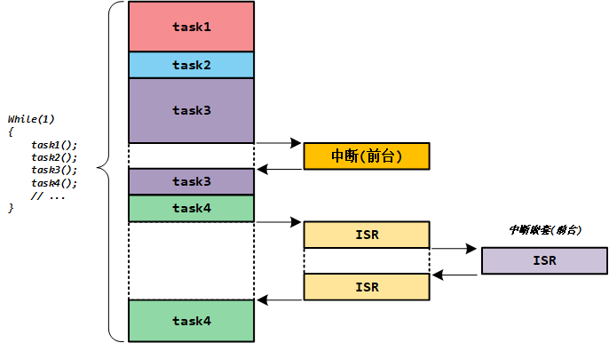
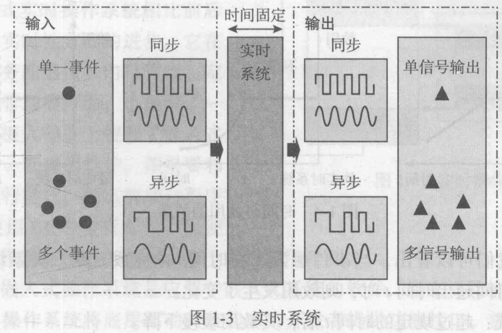
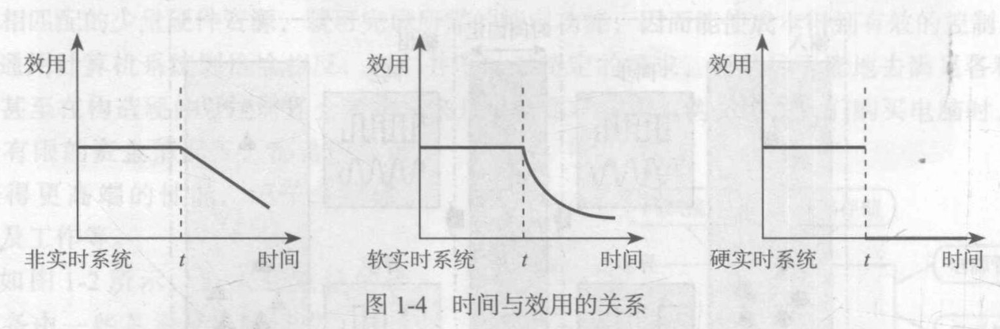

<!-- more -->

>参考资料：[FreeRTOS™ - FreeRTOS™](https://wwww.freertos.org/zh-cn-cmn-s)

## 一、RTOS简介

一般嵌入式系统分为两种：前后台系统和实时系统。

### 1. 前后台系统

早期嵌入式开发没有嵌入式操作系统的概念，直接操作裸机，在裸机上写程序，直接一个while大循环，在循环中实现功能。通常把程序分为两部分：前台系统 和 后台系统。

简单的小系统通常是前后台系统，这样的程序包括一个死循环和若干个中断服务程序：应用程序是一个无限循环，循环中调用API函数完成所需的操作，这个大循环就叫做后台系统。中断服务程序用于处理系统的异步事件，也就是前台系统。前台是中断级，后台是任务级。

### 2. 实时系统？

> 参考：[《嵌入式实时操作系统RT-Thread设计与实现》](https://pan.baidu.com/s/1aRQ8AI24kwWW4nTk2CKC4g?pwd=rpxn) 提取码: rpxn 

#### 2.1 什么是实时系统？

系统的实时性指的是在固定的时间内正确地对外部事件做出响应。在这段“时间内”系统内部会做一些处理，例如输入数据的分析计算、加工处理等。而在这段时间之外，系统可能会空闲下来，做一些空余的事。以一个手机终端为例：当一个电话拨入的时候，系统应当及时发出振铃、声音提示以通知主人有来电，询问是否进行接听;而在非电话拨入的时候，人们可以用它进行一些其他操作，例如听音乐、玩游戏等。

从上面的例子我们可以看出，实时系统是一种需求倾向性的系统，对于实时的任务需要在第一时间内做出回应，而对非实时任务则可以在实时事件到达时为之让路——被抢占。所以也可以将实时系统看成是一个等级系统，不同重要性的任务具有不同的优先等级：重要的任务能够优先被响应执行，非重要的任务可以适当往后推迟。

实时计算可以定义成这样一类计算，即**系统的正确性不仅取决于计算的逻辑结果，还依赖于产生结果的时间**。有两个关键点，即正确地完成和在给定的时间内完成，且两者重要性是等同的。如果计算结果出错，这将不是一个正确的系统，而计算结果正确，但计算所耗费的时间已经偏离需求设定的时间，那么这也不是一个实时系统。图1-3描述了一个实时系统。

对于输入的信号、事件，实时系统必须能够在规定的时间内得到正确的响应，而不管这些事件是单一事件、多重事件，还是同步信号或异步信号。

#### 2.2 RTOS？

RTOS(**Real-Time Operating System**)，实时操作系统。实时性是其最大特征，实时操作系统中都要包含一个**实时任务调度器**，这个任务调度器与其它操作系统的最大不同是强调：严格按照优先级来分配CPU时间，并且时间片轮转**不是**实时调度器的一个必选项。

我们去FreeRTOS官网看一眼，[RTOS 基础知识 - FreeRTOS™](https://wwww.freertos.org/zh-cn-cmn-s/Documentation/01-FreeRTOS-quick-start/01-Beginners-guide/01-RTOS-fundamentals)。实时操作系统 (RTOS) 是一种体积小巧、确定性强的计算机操作系统。 RTOS 通常用于需要在严格时间限制内对外部事件做出反应的嵌入式系统，如医疗设备和汽车电子控制单元 (ECU)。 通常，此类嵌入式系统中只有一两项功能需要确定性时序，即使嵌入式系统不需要严格的实时反应，使用 RTOS 仍能提供诸多优势。 

也可以这样理解：

实时操作系统（RTOS）是指当外界事件或数据产生时，能够接受并以足够快的速度予以处理，其处理的结果又能在规定的时间之内来控制生产过程或对处理系统做出快速响应，调度一切可利用的资源完成实时任务，并控制所有实时任务协调一致运行的操作系统。

实时系统的正确性不仅依赖系统计算的逻辑结果，还依赖于产生这个结果的时间。换句话说，系统设计时所有的事件都可以在指定的时间内得到响应（时间确定性）。如果系统关键任务响应时间都满足这条标准，则这样的实时系统可称为硬实时系统。**提供及时响应和高可靠性**是RTOS的主要特点。

### 3. 硬实时与软实时

正如上面所描述的，实时系统关注的不外乎两点，即**时间的正确性和功能的正确性**。事实上，衡量一个实时系统的正确性正是如此，就是要求系统能在给定的时间内正确地完成相应的任务。但现实中也存在这样一种系统，即在多数情况下，它能够严格地在规定的时间内完成任务，但偶尔它也会稍微超出这个给定的时间范围才能正确地完成任务，我们通常把这种系统称为软实时系统。从系统对规定时间的敏感性的要求来看，实时系统可以分为硬实时系统和软实时系统。

硬实时系统**严格限定在规定的时间内完成任务**，否则就可能导致灾难的发生，例如导弹拦截系统，汽车引擎系统等，当这些系统不能满足规定的响应时间时，即使只是偶尔也将导致车毁人亡等重大灾难的发生。

软实时系统，**可以允许偶尔出现一定的时间偏差**，但是随着时间的偏移，整个系统的正确性也会随之下降，例如可以将一个DVD播放系统看成一个软实时系统，允许它偶尔出现画面或声音延迟。

图1-4 绘制了这三种系统(非实时系统、软实时系统和硬实时系统)的时效关系。

从图1-4中我们可以看出，当事件触发，在时间内完成，则三类系统的效用是相同的。但是当完成时间超出时间z时，则效用发生了变化。

- 非实时系统：超过规定的时间t后，其效用缓慢下降，
- 软实时系统：超过规定的时间后，其效用迅速下降。
- 硬实时系统：超过规定的时间后，其效用立即归零。

### 4. 为什么要用RTOS？

直接看的这里：[FreeRTOS 常见问题：定义 - FreeRTOS™](https://wwww.freertos.org/zh-cn-cmn-s/Why-FreeRTOS/FAQs/What-is-this-all-about#为什么使用-rtos)

- 摘出定时信息：实时调度器实际上只是一段代码，它使得您可以指定应用程序的 定时特性，极大地简化、缩减 应用程序代码（从而使其更便于理解）。
- 可维护性/可扩展性：代码中不包含定时信息，可以提高可维护性和可扩展性， 因为您的软件模块之间的相互依赖性会降低。更改一个模块不应 影响另一个模块的时间行为（取决于任务的优先级划定）。软件 也将不容易受到硬件变化的影响。例如，编写代码时可以 使其在时间上不受处理器频率变化（在合理范围内）的影响。
- 模块化：将您的应用程序组织成一组自主任务，可以使模块化更有效。任务应该 是松散耦合和功能内聚的单元，其内部按顺序执行。 例如，无需将函数分解为微型状态机来防止它们 需要过长时间才能执行完成。
- 接口更清晰：定义明确的任务间通信接口有助于设计和团队开发。
- 测试更容易（在某些情况下）：无需添加可能改变被测试模块行为的仪表，就可以执行任务接口 。
- 代码复用：模块化程度提高，模块间的依赖度降低，便于项目间复用代码。任务 本身有助于在项目中复用代码。以后者为例，假设一个应用程序 从 TCP/IP 堆栈接收连接，则可以生成相同的任务代码来处理每个连接， 每个连接使用一个任务。
- 效率是否会提高？：使用 FreeRTOS 允许任务阻塞事件——无论是时间事件，还是系统外部事件。这意味着 实际上没有事件需要处理时不会浪费时间轮询或检查定时器， 从而大大节约对处理器的利用。FreeRTOS 只会按需执行代码。但与之相反的是， 您将需要运行 RTOS tick 并且需要花费时间在任务之间切换。节省的处理器时间 是否超过开销取决于应用程序（反之亦然）。大多数应用程序都会运行某种形式的 tick，因此使用 tick 钩子函数可消除额外开销。
- 空闲时间：使用 FreeRTOS.org 很容易测量处理器的负载。只要空闲任务正在运行， 您就知道处理器无事可做。空闲任务还提供了一个非常简单的自动方法， 将所述处理器设为低功耗模式。
- 中断处理灵活：将中断触发的处理延迟到任务级别可以将中断处理程序的时间压缩到很短， 并且在任务级别处理完成时让中断保持在启用状态。 此外，任务级别的中断处理有助于灵活划定优先级， 比使用硬件本身给每个外围设备分配优先级（取决于使用的架构）更灵活 。
- 混合处理要求：简单的设计模式可以用于混合应用程序内的周期性、连续性和事件驱动的处理操作 。此外，可以通过使用 中断和任务优先级划定来满足软硬实时要求。
- 外围设备控制更容易：守卫任务便于序列化对外围设备的访问，并提供良好的互斥机制 。

## 二、FreeRTOS

### 1. 简介

常用的RTOS有国外的FreeRTOS、μC/OS、RTX和国内的FreeRTOS、Huawei LiteOS和AliOS-Things等， 其中尤以国外开源且免费的FreeRTOS的市场占有率最高。

我们可以去官网看一眼：[FreeRTOS™ - FreeRTOS™](https://wwww.freertos.org/zh-cn-cmn-s)，首页就有FreeRTOS的介绍

> FreeRTOS：适用于微控制器和小型微处理器的实时操作系统.
>
> FreeRTOS 是一款市场领先的嵌入式系统， RTOS 支持 40 多种处理器架构，内存占用小，执行时间快，具有尖端的 RTOS 功能和库，包括对称多处理 (SMP)、具有 IPv6 支持的线程安全 TCP 堆栈以及与云服务的无缝集成。它是**开源**的，并得到了积极的支持和维护。

### 2. 为什么使用FreeRTOS？

>“现在我几乎可以肯定地说，FreeRTOS 经历的‘同行评审’要远多于市面上其他的 RTOS 。我曾在多个项目中使用 FreeRTOS，其中一个项目采用多处理器环境， 使用的处理器超过 64 个，需要可靠地运行数月。RTOS 核心表现非常出色。试着使用 FreeRTOS 看看吧。”
>
>——John Westmoreland

**FreeRTOS 集合了所有优点**：FreeRTOS 真正免费，得到全方位支持， 即使在商业应用中也是如此。 [FreeRTOS 采用 MIT 开源许可](https://wwww.freertos.org/Documentation/02-Kernel/01-About-the-FreeRTOS-kernel/04-Licensing)， 不要求您公开专有知识产权。在使用 FreeRTOS 将产品推向市场时，您无需告知我们， 更无需支付费用，成千上万的人都是这样做的。如果您希望获得额外支持， 或者您的法律团队需要额外的书面保证或赔偿， 我们随时都可以为您提供[简单且低成本的商业升级路径](https://wwww.freertos.org/Documentation/02-Kernel/01-About-the-FreeRTOS-kernel/04-Licensing#optional-freertos-commercial-licensing)。 请尽管放心，您随时都可选择走商业路线。

为什么 FreeRTOS 是您开发下一个应用程序的明智选择？原因如下 - FreeRTOS……

- 提供统一且独立的解决方案，适用于多种不同的架构和开发工具。
- 可靠性众所周知。姐妹项目 SafeRTOS 所执行的活动提供了额外的信心保证。
- [功能丰富](https://wwww.freertos.org/Why-FreeRTOS/highlighted-features)且仍在持续积极开发中。
- 占用的 ROM 和 RAM 较少，处理开销也较低。RTOS 内核二进制映像通常 介于 6K 到 12K 字节之间。
- 非常简单易用，RTOS 内核的核心仅包含 在 [3 个 C 文件](https://wwww.freertos.org/Documentation/02-Kernel/06-Coding-guidelines/01-Source-code-organization)中。 .zip 文件下载内容中包含的大多数文件仅与演示应用程序有关。
- 对商业应用完全免费 （详情请参阅[许可条件](https://wwww.freertos.org/Documentation/02-Kernel/01-About-the-FreeRTOS-kernel/04-Licensing)） 。
- 以 OPEN**RTOS** 的形式提供商业许可、专业支持和移植服务 （由我们的合作伙伴 [WITTENSTEIN High Integrity Systems](https://www.highintegritysystems.com/) 提供） 。
- 可迁移至 [Safe**RTOS**](https://www.highintegritysystems.com/)，提供 医疗、汽车和工业领域的认证。
- 用户群非常庞大，且仍在不断壮大。
- 每个移植都包含一个预配置示例。无需明白如何设置项目，只需下载和编译即可！
- 拥有优秀、活跃并受到广大用户监督的免费[支持论坛](https://forums.freertos.org/)。
- 确保随时为您提供商业支持。
- 提供丰富的文档。
- 易于扩展、简单易用。
- FreeRTOS 可为那些不适合或无法在 eCOS、嵌入式 Linux （或实时 Linux）甚至 uCLinux 上开发的应用程序提供更小巧、更简单的实时处理系统。

>参考资料：
>
>[(8 封私信) 什么是实时系统、硬实时、软实时？为什么嵌入式系统多为实时系统？ - 知乎](https://www.zhihu.com/question/358777846)
>
>[野火 FreeRTOS 内核实现与应用开发实战](https://doc.embedfire.com/rtos/freertos/zh/latest/index.html)
>
>[什么是RTOS？RTOS与普通操作系统的区别-CSDN博客](https://blog.csdn.net/mxh3600/article/details/124500906)
