<!-- more -->


## 一、I2C简介

### 1. I2C介绍

I2C 就是 I2C （ Inter－Integrated Circuit ）总线，是一种多主从架构串行通信总线。在1980年由 PHILIPS  （飞利浦）公司开发的两线式**串行**、半双工总线，用于连接微控制器及其外围设备。它可以让主板、嵌入式系统或手机连接低速周边设备， 如今在嵌入式领域是非常常见。

它是由数据线  SDA  和时钟  SCL  构成的串行总线，可发送和接收数据。在  CPU  与被控  IC  之间、  IC  与  IC  之间进行双向传送数据， 标准 I2C 总线传输速率可到 100kbps ，高速  I2C  总线一般可达  400kbps  以上。

主要用于近距离、低速的芯片之间的通信； I2C 总线有两根双向的信号线一根数据线 SDA 用于收发数据，一根时钟线 SCL 用于通信双方时钟的同步； I2C 总线硬件结构简单，成本较低，因此在各个领域得到了广泛的应用。

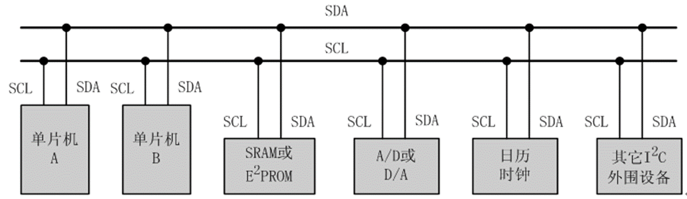

每个接到I2C总线上的器件都有一个唯一的地址，主机与其他器件进行数据传输的时候，在I2C总线上发送数据的称之为**发送器**，总线上接收数据的器件被称为**接收器**。

### 2. 模拟I2C与硬件I2C

因为I2C协议比较简单，常常用GPIO来模拟I2C时序，这种方法称为模拟I2C。如果使用MCU的I2C控制器，设置好I2C控制器, I2C控制器就自动实现协议时序，这种方式称为硬件I2C。因为I2C设备的速率比较低，通常两种方式都可以，模拟I2C方便移植，硬件I2C工作效率相对较高。  

### 3. I2C 总线特点

（1）I2C 总线是一种多主机总线，连接在 I2C 总线上的器件分为主机和从机两种，主机有权发起和结束一次通信，而从机只能被主机呼叫；当总线上有多个主机同时启用总线时， I2C 也具备**冲突检测和仲裁**的功能来决定由哪个设备占用总线，防止错误产生。

（2）每个连接到 I2C 总线上的器件都有一个唯一的地址( 7bit )，且每个器件都可以作为主机也可以作为从机（同一时刻只能有一个主机），总线上的器件增加和删除不影响其他器件正常工作； I2C 总线在通信时总线上发送数据的器件称为**发送器**，接收数据的器件称为**接收器**。

（3）总线通过上拉电阻接到电源。当 I2C 设备空闲时，会输出高阻态， 而当所有设备都空闲，都输出高阻态时，由上拉电阻把总线拉成高电平。

（4）具有三种传输模式：标准模式传输速率为 100kbit/s  ，快速模式为 400kbit/s  ， 高速模式下可达  3.4Mbit/s ，但目前大多 I2C 设备尚不支持高速模式。

连接到相同总线的  IC  数量受到总线的最大电容  400pF  限制。

## 二、基本原理？

### 1. 一个实例

关于I²C协议，我在学习的时候在一个资料上看到了一个例子，大概就是老师（ MCU）将球（数据）传给众多学生中的一个（众多外设设备中的一个）。  

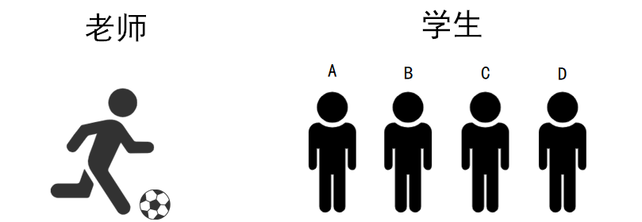

- 首先老师将球踢给某学生， 即主机发送数据给从机，步骤如下：

（1）老师：开始了(start)；

（2）老师： A！我要发球给你！ (地址/方向)；

（3）学生A：到！ (回应)；

（4）老师把球发出去（传输） ；

（5）A收到球之后，应该告诉老师一声（回应） ；

（6）老师：结束（停止） ；  

- 接着老师让学生把球传给自己，即从机发送数据给主机，步骤如下：  

（1）老师：开始了(start)；

（2）老师： B！把球发给我！ (地址/方向)；

（3） 学生B：到！

（4）B把球发给老师（传输） ；

（5）老师收到球之后，给B说一声，表示收到球了（回应） ；

（6）老师：结束（停止） 。  

### 2. 实例总结

从上面的例子可知， 都是老师（主机） 主导传球， 按照规范的流程（通信协议），以保证传球的准确性，收发球的流程总结如下：

（1）老师说开始了，表示开始信号(start)；

（2）老师提醒某个学生要发球，表示发送地址和方向(address/read/write)；

（3）该学生回应老师(ack)；

（4）老师发球/接球，表示数据的传输；

（5）收到球要回应：回应信号(ACK)；

（6）老师说结束，表示I2C传输结束(P)。

以上就是I2C的传输协议，如果是软件模拟I2C，需要依次实现每个步骤。 因此，还需要知道每一步的具体细节，比如什么时候的数据有效， 开始信号怎么表示。  

## 三、I2C 协议相关术语

这一部分会结合实例代码来说明，主要是通过模拟I2C来学习。

### 1. 相关宏定义

下边的软件模拟的平台为 STM32F103ZET6 ，所出现的宏定义有：

```c
#define SDA_IN()  {GPIOB->CRL&=0X0FFFFFFF;GPIOB->CRL|=(u32)8<<28;} /* 设置GPIO为输入 */
#define SDA_OUT() {GPIOB->CRL&=0X0FFFFFFF;GPIOB->CRL|=(u32)3<<28;} /* 设置GPIO为输出 */

//IO操作函数	 
#define IIC_SCL    PBout(6) /* SCL时钟线 */
#define IIC_SDA    PBout(7) /* SDA输出 */	 
#define READ_SDA   PBin(7)  /* SDA输入 */ 
```

### 2. 空闲状态

I2C 总线的 SDA 和 SCL 两条信号线**同时处于高电平**时，规定为总线的**空闲状态**。此时各个器件的输出级场效应管均处在截止状态（对外为高阻态），即释放总线，由两条信号线各自的上拉电阻把电平拉高。

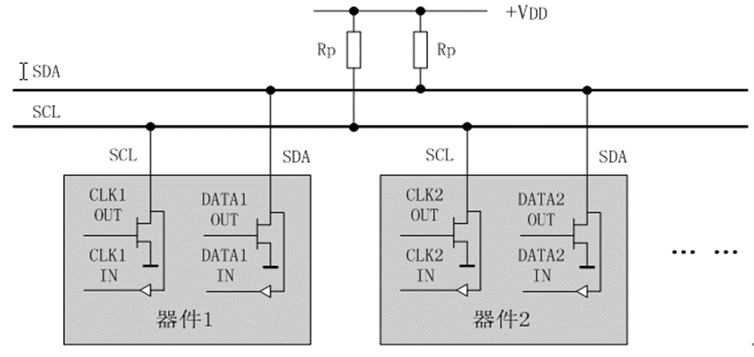

### 2. 起始信号和停止信号

#### 2.1相关概念

- 起始信号（S）：当 SCL 为高期间， SDA 由**高到低的跳变**；起始信号是一种电平跳变时序信号，而不是一个电平信号。

- 停止信号（P）：当 SCL 为高期间， SDA 由**低到高的跳变**；停止信号也是一种电平跳变时序信号，而不是一个电平信号。

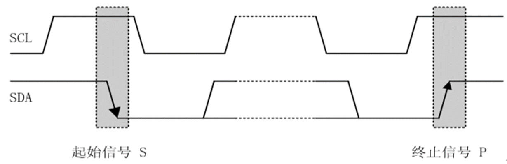

**【注意】**起始信号和停止信号都是由主机发出，**起始信号产生后总线处于占用状态**，**停止信号产生后总线处于空闲状态**。

#### 2.2 软件模拟

##### 2.2.1 起始信号模拟

```c
/* 产生IIC起始信号 */
void IIC_Start(void)
{
	SDA_OUT();     /* SDA 数据线设置为输出 */
	IIC_SDA=1;	   /* SDA 数据线拉高表示空闲状态 */  
	IIC_SCL=1;     /* SCL 时钟线拉高表示空闲状态 */  
	delay_us(4);   
 	IIC_SDA=0;     /* START:when CLK is high, DATA change form high to low  */
	delay_us(4);
	IIC_SCL=0;     /* 钳住I2C总线(拉低SCL时钟线，SDA数据线也为低)，准备发送或接收数据  */
}
```

##### 2.2.2 停止信号模拟

```c
/* 产生IIC停止信号 */
void IIC_Stop(void)
{
	SDA_OUT();   /* SDA 数据线设置为输出 */
	IIC_SCL=0;   /* SCL 时钟线拉低 */  
	IIC_SDA=0;   /* STOP: when CLK is high，DATA change form low to high (为停止信号做准备)*/
 	delay_us(4);
	IIC_SCL=1;   /* SCL 时钟线拉高，并保持高电平 */  
	IIC_SDA=1;   /* SDA 数据线原来为低，现在拉高，产生一个由低到高的跳变，表示I2C总线停止信号 */
	delay_us(4);							   	
}
```

###  3. 应答信号

#### 3.1 相关概念

发送器每发送一个字节（8位数据），每次传输后由**接收器（从机）反馈一个应答信号**，以**确认从机是否正常接收了数据**。 当主机发送了8位数据后，会再产生一个时钟，  也就是在时钟的**第 9 个脉冲**（前 8 个表示传输 8 位数据）期间释放 SDA 数据线，主机由输出转为读取，读取SDA电平， 这个时候SDA数据线在上拉电阻的影响下，此时SDA默认为高，必须从机拉低， 以确认收到数据。   

- 应答信号为低电平时，规定为**有效应答位**（ ACK 简称应答位），表示接收器已经成功地接收了该字节。
- 应答信号为高电平时，规定为**非应答位**（ NACK ），一般表示接收器接收该字节没有成功，非应答位可以用于告诉主机结束数据发送。

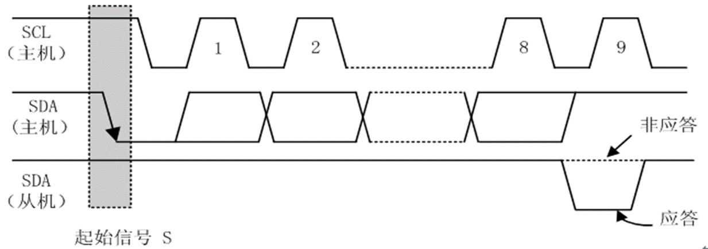

当  I2C  主机发送完  8 位数据以后会释放SDA总线，将  SDA  设置为输入状态，等待  I2C  从机应答，也就是等到  I2C  从机告诉主机它接收到数据了。**应答信号是由从机发出的**，主机需要提供应答信号所需的时钟，主机发送完  8  位数据以后紧跟着的一个时钟信号就是给应答信号使用的。从机通过将  SDA  拉低来表示发出应答信号，表示通信成功，否则表示通信失败。  

**【注意】**

（1）为了传输一个ACK位，主机端需要产生一个时钟脉冲，也就是第九个时钟脉冲；

（2）对于反馈有效应答位 ACK 的要求是，接收器在第 9 个时钟脉冲之前的低电平期间将 SDA 线拉低，并且确保在该时钟的高电平期间SDA为稳定的低电平。 如果接收器是主控器，则在它收到最后一个字节后，发送一个 NACK 信号（即不发出ACK信号），以通知被控发送器结束数据发送，并释放 SDA 线，以便主控接收器发送一个停止信号 P 。

#### 3.2 软件模拟

##### 3.2.1 产生ACK应答信号

- 从机应答信号模拟（这种情况一般是从从机读数据，主机产生应答，告诉从机我读完了）

```c
/* 产生ACK应答 */
void IIC_Ack(void)
{
	IIC_SCL=0;    /* SCL 时钟线拉低 */
	SDA_OUT();    /* SDA 数据线设置为输出 */
	IIC_SDA=0;    /* SDA 数据线拉低（应答，第9个脉冲期间保持低电平） */
	delay_us(2); 
	/* SCL 时钟线产生一个脉冲（第9个，低->高->低） */
	IIC_SCL=1;    /* SCL 时钟线拉高 */
	delay_us(2);
	IIC_SCL=0;    /* SCL 时钟线拉低 */
}
```

##### 3.2.2 不产生ACK应答信号

- 从机非应答信号模拟（这种情况一般是从从机读数据，主机不产生应答，这时候要注意接收应答的一方若是一直等待的话可能就会有问题了）

```c
/* 不产生ACK应答 */
void IIC_NAck(void)
{
	IIC_SCL=0;   /* SCL 时钟线拉低 */
	SDA_OUT();   /* SDA 数据线设置为输出 */
	IIC_SDA=1;   /* SDA 数据线拉高（不应答，第9个脉冲期间保持高电平） */
	delay_us(2);
	/* SCL 时钟线产生一个脉冲（第9个）（第9个，低->高->低） */
	IIC_SCL=1;   /* SCL 时钟线拉高 */
	delay_us(2);
	IIC_SCL=0;   /* SCL 时钟线拉低 */
}
```

##### 3.2.3 等待应答信号

- 主机等待应答信号（这种情况一般是向从机写数据，从机会产生应答，从机的应答不需要我们来管，读到应答信号的时候表示写入完成，从机收到了数据）

```c
unsigned char IIC_Wait_Ack(void)
{
	unsigned char ucErrTime=0;
	SDA_IN();      // SDA设置为输入  
	IIC_SDA=1;delay_us(1);	   
	IIC_SCL=1;delay_us(1);	 
	while(READ_SDA)
	{
		ucErrTime++;
		if(ucErrTime>250)
		{
			IIC_Stop();
			return 1;
		}
	}
	IIC_SCL=0; // 时钟输出0 	   
	return 0;  
} 
```


### 4. 数据传送

#### 4.1 相关规则

I2C 总线进行数据传送时

- 时钟线 SCL 上的信号为高电平期间：接收器从数据线上读取一位数据，数据线 SDA 上的数据必须保持稳定，不允许发生变化。也就是， SCL为高电平时表示有效数据， SDA为高电平表示“ 1”，低电平表示“0”。

- 时钟线 SCL 上的信号为低电平期间：数据线上的高电平或低电平状态允许变化，只有在这种情况下发送器才能向数据线上发送一位数据。也就是 SCL为低电平时表示无效数据，此时SDA可以进行电平切换，为下次数据表示做准备。

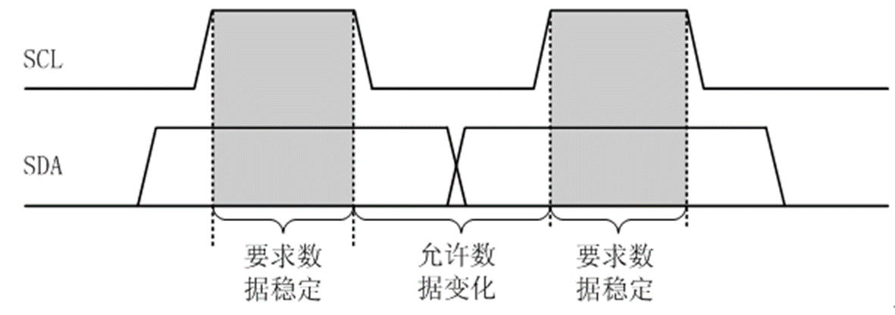

在 I2C 总线上传送的每一位数据都有一个时钟脉冲相对应（或同步控制），即在 SCL 串行时钟的配合下，在 SDA 上**逐位**地串行传送每一位数据，数据位的传输是边沿触发。

I2C 总线通信时每个字节为 8 位长度，数据传送时，**先传送最高位，后传送低位**，发送器发送完一个字节数据后接收器必须发送 1 位应答位来回应发送器即一帧共有 9 位。

【注意】数据在 SCL 的上升沿到来之前就需准备好。并在在下降沿到来之前必须稳定。

#### 4.2 软件模拟

##### 4.2.1 发送一个字节

```c
/* 发送1个字节，txd表示要发送的一个字节数据 */		  
void IIC_Send_Byte(unsigned char txd)
{                        
    unsigned char t;   
	SDA_OUT(); 	    
    IIC_SCL=0;             /* 拉低 SCL 时钟线，准备开始数据传输（SCL为低时 SDA上的信号才允许变化） */
    for(t=0;t<8;t++)       /* 循环发送8位数据 */
    {              
        //IIC_SDA=(txd&0x80)>>7;
		if((txd&0x80)>>7)  /* 获取最高位（0x80=1000 0000），将最高位右移7位到最低位。再判断这一位0还是为1 */
			IIC_SDA=1;
		else
			IIC_SDA=0;
		txd<<=1; 	        /* 将下一位左移到最高位，为下一次发送做准备 */  
		delay_us(2);
		/* 数据准备完毕，接下来SCL产生一个 低->高->低 的脉冲变化，完成一位数据发送 */
		IIC_SCL=1;          /* SCL 时钟线拉高 */
		delay_us(2); 
		IIC_SCL=0;	        /* SCL 时钟线拉低 */
		delay_us(2);
    }	 
} 
```

##### 4.2.2 读取一个字节

```c
/* 读1个字节，ack=1时，发送ACK，ack=0，发送nACK */   
unsigned char IIC_Read_Byte(unsigned char ack)
{
	unsigned char i,receive=0;
	SDA_IN();              /* SDA 数据线设置为输入 */
    for(i=0;i<8;i++ )      /* 循环读取8位数据 */
	{
        IIC_SCL=0;         /* SCL 时钟线拉低 */
        delay_us(2);
		IIC_SCL=1;         /* SCL 时钟线拉高（高电平期间从数据线SDA读取1位数据） */
        receive<<=1;       /* 数据左移，因为发送方先发的是高位 */
        if(READ_SDA) receive++;   /* 读到的是1的话，最低位加1 */
		delay_us(1); 
    }					 
    if (!ack)
        IIC_NAck();        /* 发送nACK（不应答） */
    else
        IIC_Ack();         /* 发送ACK（应答） */   
    return receive;
}
```

### 5. 总线仲裁机制

总线上可能挂接有多个器件，有时会发生两个或多个主器件同时想占用总线的情况，这种情况叫做总线竞争。I2C总线具有多主控能力，可以对发生在SDA线上的总线竞争进行仲裁，其仲裁原则是：**当多个主器件同时想占用总线时，如果某个主器件发送高电平，而另一个主器件发送低电平，则发送电平与此时SDA总线电平不符的那个器件将自动关闭其输出级**。

总线竞争的仲裁是在两个层次上进行的。首先是地址位的比较，如果主器件寻址同一个从器件，则进入数据位的比较，从而确保了竞争仲裁的可靠性。由于是利用I2C总线上的信息进行仲裁，因此不会造成信息的丢失。

### 6. 地址及数据方向

I2C总线上的每个设备都有自己的独立地址，主机发起通讯时，通过SDA信号线发送设备地址(SLAVE_ADDRESS)来查找从机。设备地址可以是7位或10位。  紧跟设备地址的一个数据位R/W用来表示数据传输方向， 数据方向位为“1”时表示主机由从机读数据，该位为“0”时表示主机向从机写数据。  

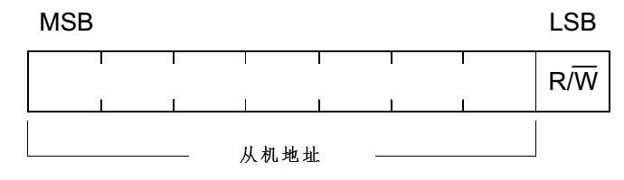


## 五、 I2C 读写时序

从机接收到匹配的地址后，主机或从机会返回一个应答( ACK )或非应答( NACK )信号，只有接收到应答信号后，主机才能继续发送或接收数据。

### 1. I2C 写时序

主机写数据到从机的时序如下图所示：

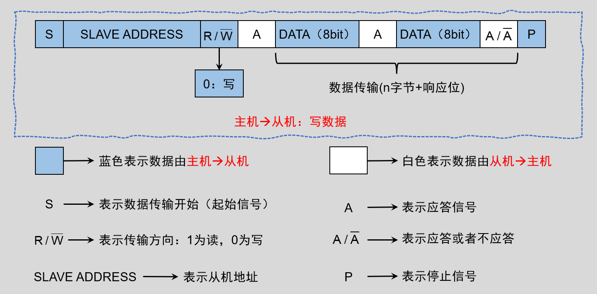

- （1）主机发送一个起始信号S，表示启动I2C；
- （2）发送从机 7 位地址和 1 位读写标志，读写标志为0，表示写；
- （3）主机释放 SDA 数据线（拉高），便于后续接收从机的回应，若有从机匹配到主机发送的地址，则从机会拉低 SDA 线作为ACK（有效应答）；
- （4）接收到应答后，主机重新拉低 SDA，准备发送数据，然后开始传输8位数据，先发高位，再发低位；
- （5）8 位数据传输完成后，主机释放SDA线，便于接收从机发出的应答或者非应答信号；
- （6）从机收到数据后，拉低 SDA数据线作为 ACK （应答信号），告诉主机数据接收成功；
- （7）主机发出停止信号，表示结束I2C通信。

### 2. I2C 读时序

主机由从机中读取数据（从机写数据到主机）的时序如下图：

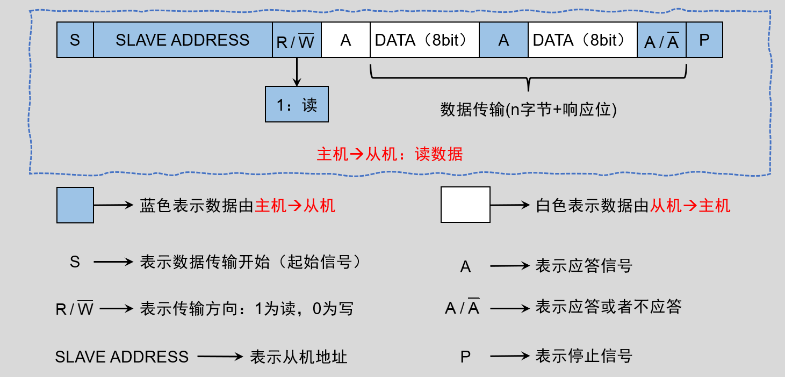

- （1）主机发送一个起始信号S，表示启动I2C；
- （2）发送从机7位地址和1位读写标志，读写标志为1表示读；
- （3）主机释放 SDA 数据线便于后续接收从机的回应，当有从机匹配到地址时，从机会拉低SDA数据线作为 ACK（有效应答）；
- （4）然后从机继续拉高SDA线，准备开始使用SDA数据线传输 8 位数据给主机；
- （5）8 位数据传输完毕后，从机释放SDA数据线(拉高)，便于接收主机的回应；
- （6）主机接收到数据；
- （7）主机获得SDA线控制权限，并拉低SDA数据线作为 ACK （有效应答）告诉从机数据接收成功；
- （8）主机发出停止信号，表示结束I2C。

### 3. I2C 复合通信

我们操作 I2C 设备的时候，多数情况都是先向设备写入数据，后续就是从设备中读取数据了，主机先向从机发送数据，然后从机再向主机发送数据的时序如下图：

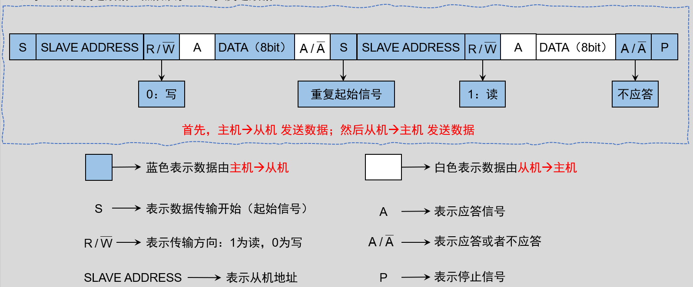

### 4. 完整传输流程

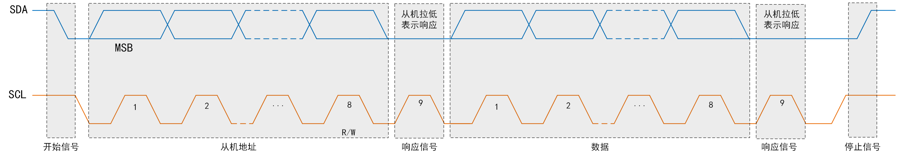

I2C完整传输流程如下：

（1）SDA和SCL开始都为高， 然后主机将SDA拉低， 表示开始信号；

（2）在接下来的8个时间周期里，主机控制SDA的高低， 发送从机地址。 其中第8位如果为0， 表示接下来是写操作，即主机传输数据给从机； 如果为1，表示接下来是读操作，即从机传输数据给主机； 另外， 数据传输是从最高位到最低位，因此传输方式为MSB（ Most Significant Bit）。

（3）总线中对应从机地址的设备，发出应答信号；

（4）在接下来的8个时间周期里，如果是写操作，则主机控制SDA的高低；如果是读操作，则从机控制SDA的高低；

（5）每次传输完成， 接收数据的设备， 都发出应答信号；

（6）最后， 在SCL为高时， 主机由低拉高SDA， 表示停止信号，整个传输结束；  
