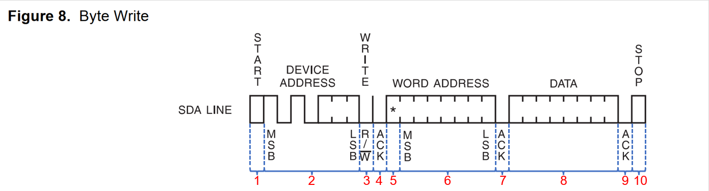
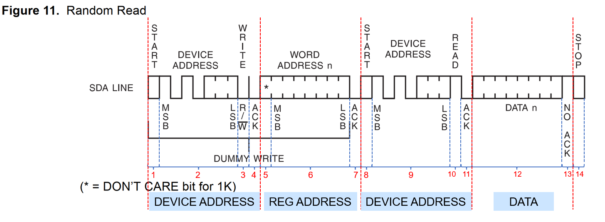

<!-- more -->

AT24C02 是一个 256 (2K/8)个字节的 EEPROM ，它使用的接口就是 I2C ，在它的芯片手册中，给出了读写时序的时序图，我们就以此器件为例分析一下 I2C 的读写时序。

## 一、单字节写时序

（1）开始信号。

（2）发送  I2C  设备地址，每个  I2C  器件都有一个设备地址，通过发送具体的设备地址来决定访问哪个  I2C  器件。这是一个  8  位的数据，其中高  7  位是设备地址，最后  1  位是读写位，为 1  的话表示这是一个读操作，为  0  的话表示这是一个写操作。

（3）  I2C  器件地址后面跟着一个读写位，为  0  表示写操作，为  1  表示读操作。

（4）从机发送的  ACK  应答信号。

（5）重新发送开始信号。

（6）发送要写写入数据的寄存器地址。

（7）从机发送的  ACK  应答信号。

（8）发送要写入寄存器的数据。  

（9）从机发送的  ACK  应答信号。

（10）停止信号。

## 二、单字节读时序

I2C  单字节读时序比写时序要复杂一点，读时序分为  4  大步，第一步是发送设备地址，第二步是发送要读取的寄存器地址，第三步重新发送设备地址，最后一步就是  I2C  从器件输出要读取的寄存器值。

（1）主机发送起始信号。

（2）主机发送要读取的  I2C  从设备地址。

（3）读写控制位，因为是向  I2C  从设备发送数据，因此是写信号。

（4）从机发送的  ACK  应答信号。

（5）重新发送  START  信号。

（6）主机发送要读取的寄存器地址。

（7）从机发送的  ACK  应答信号。

（8）重新发送  START  信号。

（9）重新发送要读取的  I2C  从设备地址。

（10）读写控制位，这里是读信号，表示接下来是从  I2C  从设备里面读取数据。

（11）从机发送的  ACK  应答信号。

（12）从  I2C  器件里面读取到的数据。

（13）主机发出  NACK  信号，表示读取完成，不需要从机再发送  ACK  信号了。

（14）主机发出  STOP  信号，停止  I2C  通信。  
