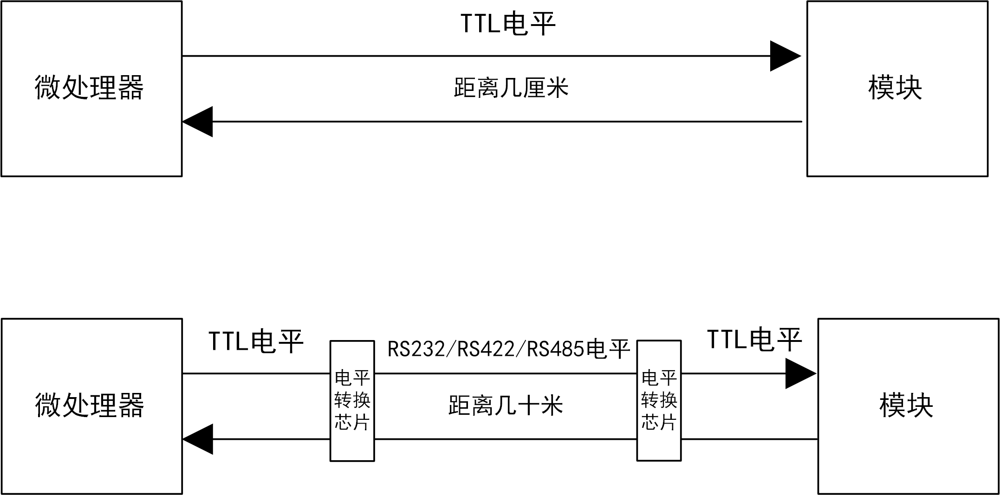
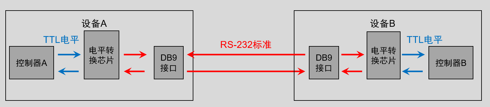
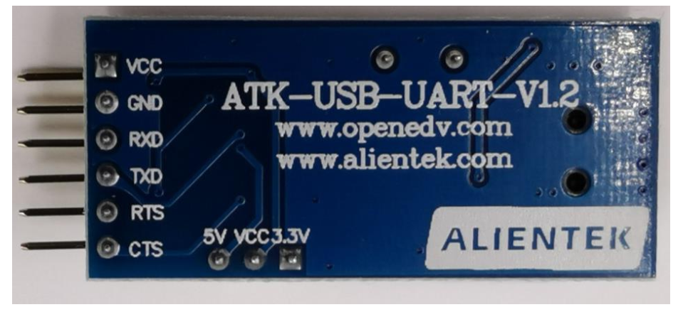
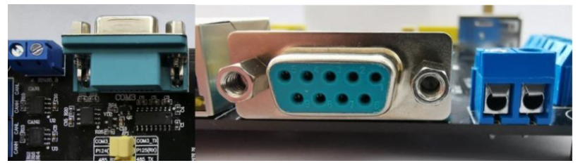
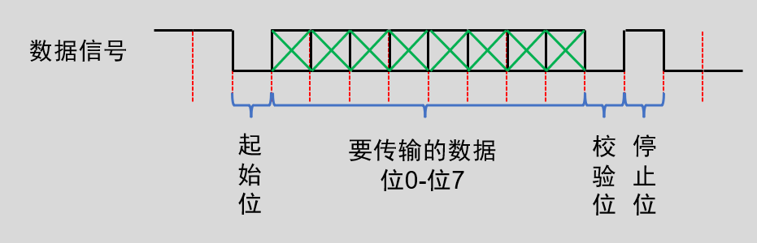
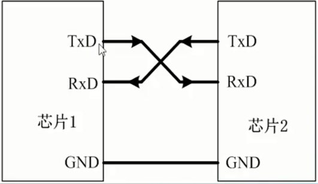
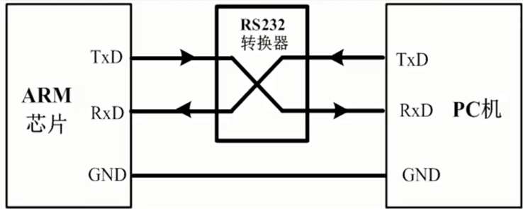
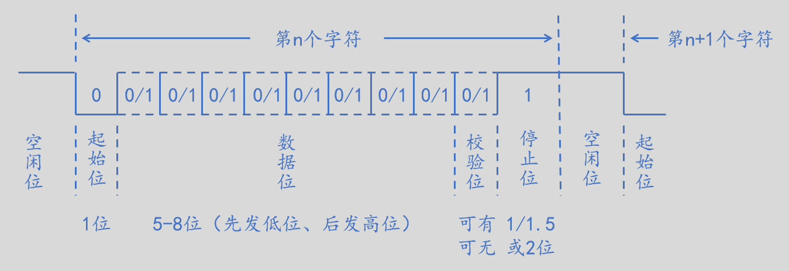
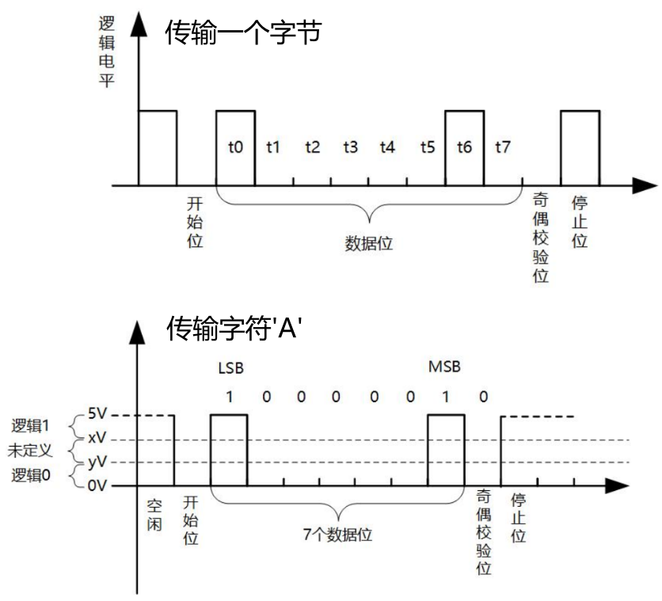

<!-- more -->

## 一、串口通信简介

### 1. 串口简介

串口通讯(Serial Communication)是一种设备间非常常用的串行通讯方式，因为它简单便捷，因此大部分电子设备都支持该通讯方式。串口全称叫做串行接口，通常也叫做 COM 接口，串行接口指的是数据一个一个的顺序传输，通信线路简单。使用两条线即可实现双向通信，一条用于发送，一条用于接收。串口通信距离远，但是速度相对会低，串口是一种很常用的工业接口。我们常用串行外设接口有UART和USART两种：

- UART：UART 全称是 Universal Asynchronous Receiver/Trasmitter，也就是异步串行收发器。

- USART：USART 的全称是 Universal Synchronous/Asynchronous Receiver/Transmitter，也就是同步/异步串行收发器。相比 UART 多了一个同步的功能，在硬件上体现出来的就是多了一条时钟线。 一般 USART 是可以作为 UART 使用的，也就是不使用其同步的功能 。

相对而言，UART我们用的更多，本篇笔记主要是关于UART通信的相关内容。

### 2. 接口标准？

说到串口，经常提到TTL、 RS232、 RS422、 RS485，简单的说，就是为了适应不同的环境条件，使用了不同的**电平标准**。假如微处理器和板载的蓝牙透传模块通信时，一般就使用TTL电平，引脚直接连接即可。假如微处理器在工业现场，需要连接一个几十米外的装置，则应该考虑将TTL电平转为RS232、 RS422、 RS485。

下表是几个通信接口标准总结，可以发现为了加大传输距离，依次尝试了增加电压、差分传输等方式。  

| 通信接口    | 电平标准                                        | 特点                                   |
| ----------- | ----------------------------------------------- | -------------------------------------- |
| TTL         | 逻辑1： 2.4V至5V 逻辑0： 0V至0.4V               | 无需额外电路，直接引脚直连即可         |
| RS232       | 逻辑1： -3V至-15V 逻辑0： 3V至15V               | 需要电平转换电路，传输距离最大约15米   |
| RS422/RS485 | 逻辑1：两线压差为2V至6V 逻辑0：两线压差-2V至-6V | 需要电平转换电路，传输距离最大约1200米 |

## 二、串口通信协议

### 1.串口通信物理层连接

串口通讯的物理层（就是硬件连接）有很多标准及变种，常见的就是 RS-232 标准，RS-232标准主要规定了信号的用途、通讯接口以及信号的电平标准。使用RS-232标准的串口设备间常见的通讯结构如下图：

### 2.电平标准

根据通讯使用的电平标准不同，串口通讯可分为TTL标准及RS-232标准：

<table>
	<tbody>
    <tr><td align="left">通信标准</td><td align="left">电平标准（发送端）</td></tr>
    <tr><td align="left" rowspan=2>5V TTL</td><td align="left">逻辑1：2.4V ~ 5.0V</td></tr>
    <tr><td align="left">逻辑0：0V ~ 0.5V  </td></tr>
    <tr><td align="left" rowspan=2>RS-232</td><td align="left">逻辑1：-15V ~ -3V </td></tr>
    <tr><td align="left">逻辑0：+3V ~ +15V </td></tr>
	</tbody>
</table>

我们知道常见的电子电路中常使用TTL的电平标准，理想状态下，使用5V表示二进制逻辑1，使用0V表示逻辑0； 对于RS-232，为了增加串口通讯的远距离传输及抗干扰能力，它使用-15V表示逻辑1，+15V表示逻辑0。 

### 3.常见接口

#### 3.1常见的 TTL 电平接口

这就是一个 USB 转 TTL 模块， TTL 接口部分有 VCC、 GND、 RXD、 TXD、RTS 和 CTS。 RTS 和 CTS 基本用不到，使用的时候通过杜邦线和其他模块的 TTL 接口相连即可。  

#### 3.2常见的 RS-232 接口

RS-232 电平需要 DB9 接口 （也就是常说的 COM口）。现在的电脑很多都没有 DB9 接口了，取而代之的是 USB 接口，所以就催生出了很多 USB 转串口 TTL 芯片，比如 CH340、PL2303 等。通过这些芯片就可以实现串口 TTL 转 USB。  

- RS-232接口缺陷

（1） 接口的信号电平值较高（+/-15V)，易损坏接口电路的芯片。

（2） 传输速率较低，在异步传输时，波特率为 20Kbps。

（3） 接口使用一根信号线和一根信号返回线而构成共地的传输形式，这种共地传输容易产生共模干扰，所以抗噪声干扰性弱。

（4） 传输距离有限，最大传输距离标准值为50英尺，实际上也只能用在50米左右。

### 4.传输协议

串口通讯的数据包由发送设备通过自身的 TXD 接口传输到接收设备的 RXD 接口。在串口通讯的协议层中， 规定了数据包的内容，它由起始位、主体数据、校验位以及停止位组成，通讯双方的数据包格式要约定一致才能正常收发数据，串口数据包基本组成如下：

### 5.波特率

异步通信中由于没有时钟信号(如前面讲解的 DB9 接口中是没有时钟信号的)， 所以两个通讯设备之间需要约定好波特率，即每个码元的长度，以便对信号进行解码，波特率的单位为：bps（bit per second）即每秒钟传送的 bit 的数量。例如上边传输协议一节的表示串口数据包基本组成的图中用虚线分开的每一格就是代表一个码元。常见的波特率为4800、9600、38400和115200等。

例如：115200bps、指每秒传送115200位。通信双方必须设置同样的同学速率才能正常通信

## 三、UART串口通信

### 1.硬件连接

UART接口一般连接情况如下：

- RXD：数据输入引脚，数据接收。

- TXD：数据发送引脚，数据发送。

有的可能还需要转换一下电平：

### 2. UART 帧格式

- **空闲位**

数据线在空闲状态的时候为逻辑“1”状态，也就是高电平，表示没有数据线空闲，没有数据传输。

- **起始位**

当要传输数据的时候先传输一个逻辑“0”，也就是将数据线拉低，表示开始数据传输。

- **数据位**

数据位就是实际要传输的数据，数据位数可选择 5~8 位，我们一般都是按照字节传输数据的，一个字节 8 位，因此数据位通常是 8 位的。低位在前，先传输，高位最后传输。

- **奇偶校验位**

在有效数据之后，有一个可选的数据校验位。由于数据通信相对更容易受到外部干扰导致传输数据出现偏差， 可以在传输过程加上校验位来解决这个问题。校验方法有奇校验(odd)、偶校验(even)、0校验(space)、1校验(mark)以及无校验(noparity)，可以不使用校验位。

（1）奇校验与偶校验：奇校验要求有效数据和校验位中“1”的个数为奇数，比如一个8位长的有效数据为：01101001，此时总共有4个“1”， 为达到奇校验效果，校验位为“1”，最后传输的数据将是8位的有效数据加上1位的校验位总共9位。偶校验与奇校验要求刚好相反，要求帧数据和校验位中“1”的个数为偶数， 比如数据帧：11001010，此时数据帧“1”的个数为4个，所以偶校验位为“0”。

（2）0校验与1校验：0校验是不管有效数据中的内容是什么，校验位总为“0”。1校验是校验位总为“1”。

- **停止位**

数据传输完成标志位，数据线变回逻辑”1”。停止位的位数可以选择 1 位、 1.5 位或 2 位高电平，一般都选择 1 位停止位。

- **波特率**

波特率就是 UART 数据传输的速率，也就是每秒传输的数据位数，一般选择 9600、38400、 115200 等。  

### 3. 发送一个字节数据

怎么发送一字节数据，比如“ A ”？ “ A ” 的ASCII值是0x41， 二进制就是0100 0001，怎样把这8位数据发送给对方呢？  

（1）双方约定好波特率、数据格式(数据位个数、停止位个数、是否使用校验位、奇校验还是偶校验)，假设数据位是8，停止位是1，校验位是1；

（2）初始电平为逻辑1； 

（3）发送方输出逻辑0，并保持1位的时间；接收方检测到逻辑0，就知道对方准备发送数据了；  

（4）发送方根据数据的bit 0设置引脚电平，并保持1位的时间；接收方读取引脚电平，得到bit 0；

（5）发送方根据数据的bit 1设置引脚电平，并保持1位的时间；接收方读取引脚电平，得到bit 1；

（6）以此类推，发出8位数据；

（7）发送方计算出校验值，设置引脚，并保持1位的时间；接收方读取引脚电平，得到校验值；注意，这步可以省略；

（8）发送方输出逻辑1，并保持1位的时间；接收方读取引脚电平， 直到数据传输结束；  

整个过程的信号的波形图如下：  

 
