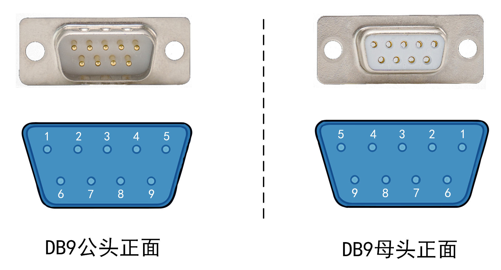
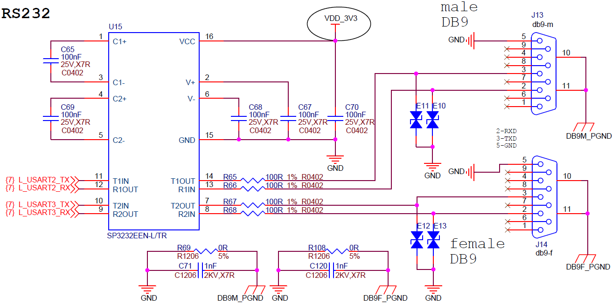
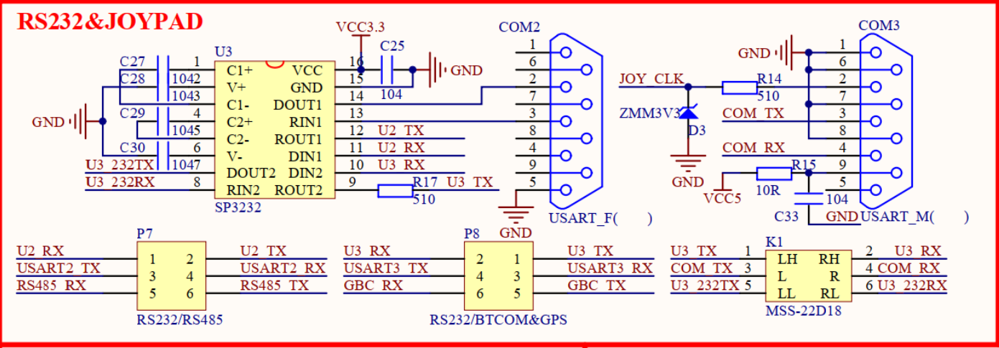

<!-- more -->

## 一、RS232简介

RS232是美国电子工业协会（ Electronic Industries Association， EIA） 于1962年发布的串行通信接口标准，其中RS为英文“ Recomend Standard”的缩写， 中文翻译为“ 推荐标准”， 232为标识号。该标准对串行通信的物理接口及逻辑电平都做了规定， 其输出的电平称为RS232电平。早期常见于个人计算机上，是计算机通讯接口之一。现如今在个人计算机上已比较少见， 但在一些工控设备依旧比较多。

最简单的RS232通信由三条数据线组成，即TXD、 RXD和GND。 RS232采用负逻辑电平，即-15V ~ -3V代表逻辑“ 1”， +3V ~ +15V代表逻辑“ 0”。这里的电平，是TxD线（或者RxD线）相对于GND的电压。RS232最长传输距离为15米，通常采用DB9接口， 有公母之分， 该接口如下图：

它其实**是串口的另外一种接口标准，本质上还是串口**，所以我们在使用RS232的时候一般只需要实现串口就可以啦。 在习惯上，通常说的串口，是指MCU引脚引出来的的UART，也就是TTL电平。 UART**可直连**其它MCU或模块的UART，或者UART转USB连接电脑，又或者UART转RS232/RS485远距离传输。这里的转换是转换芯片自动实现的，无需用户程序干预。

## 二、针脚定义

DB9有9个针脚， 通常RS232只需要TXD、 RXD和GND即可， 引脚定义如下：

| 引脚号 | 定义           | 符号                        | 备注      |
| ------ | -------------- | --------------------------- | --------- |
| 1      | 载波检测       | DCD（ Data Carrier Detect） | ——        |
| 2      | 接收数据       | RXD（ Received Data）       | RS232接收 |
| 3      | 发送数据       | TXD（ Transmit Data）       | RS232发送 |
| 4      | 数据终端准备好 | DTR（ Data Terminal Ready） | ——        |
| 5      | 信号地         | GND（ Signal Ground）       | RS232接地 |
| 6      | 通讯设备准备好 | DSR（ Data Set Ready）      | ——        |
| 7      | 请求发送       | RTS（ Request To Send）     | ——        |
| 8      | 允许发送       | CTS（ Clear To Send）       | ——        |
| 9      | 响铃提示器     | RI（ Ring Indicator）       | ——        |

## 三、硬件参考电路

这里我截取了两个不同的平台的RS232的硬件设计电路，看他们的资料的话就有，其实都是一样的。

- 平台一

- 平台二

## 四、软件设计

一般来说，硬件设计好后，软件方面只需要实现串口UART就好了，一般参考步骤如下：

（1）初始化USART1、 2、 3：设置波特率，收发选择，有效数据位等；

（2）将所使用的串口引脚初始化： USART使能、 GPIO端口时钟使能、 GPIO引脚设置为USART复用；

（3） RS232采用中断方式发送， 编写中断回调函数；

（4）主函数编写控制逻辑。
