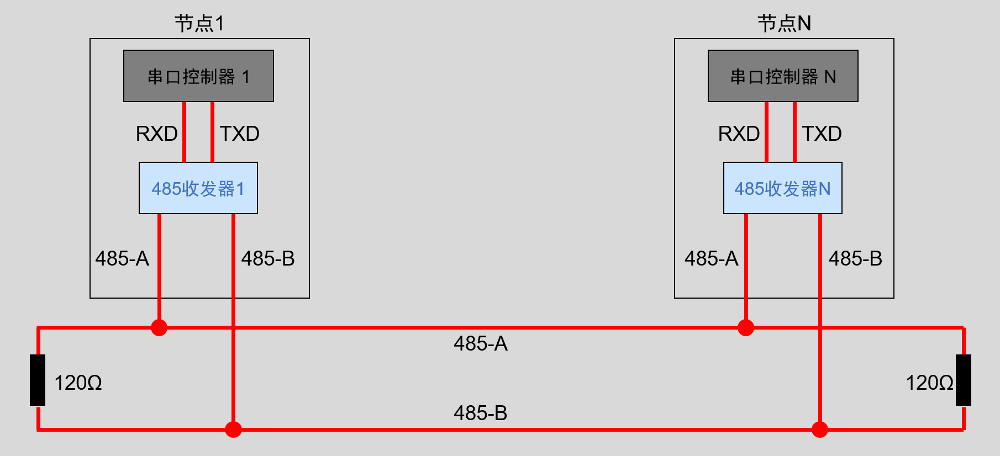
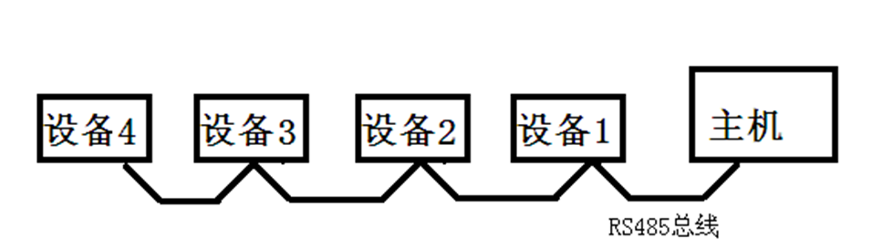
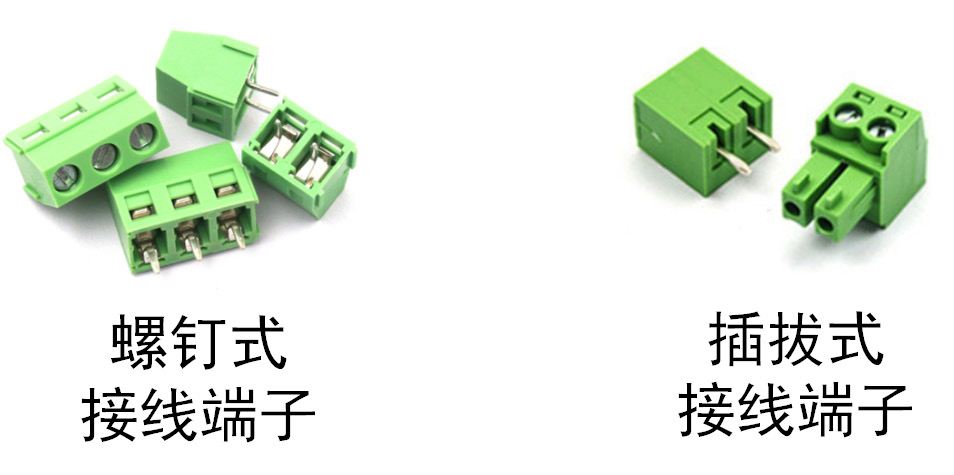
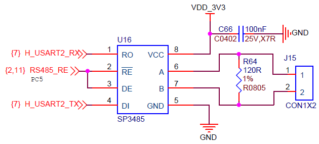
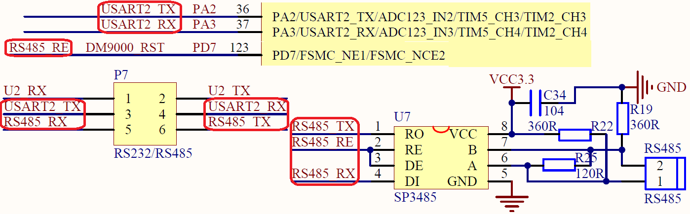

<!-- more -->

## 一、RS485简介

RS485是美国电子工业协会（ Electronic Industries Association， EIA）于1983年发布的串行通信接口标准，经通讯工业协会（ TIA）修订后命名为TIA/EIA-485-A。  485（一般称作RS485/EIA-485）是隶属于OSI模型物理层的电气特性规定为2线，半双工，多点通信的标准。用缆线两端的电压差值来表示传递信号。RS485仅仅规定了接受端和发送端的电气特性。它**没有规定或推荐任何数据协议**。

RS485比RS232晚出现20多年，很多RS232的缺点，在RS485上有了改进。RS232的电平从-15V至+15V， 较高的电平值易损坏接口电路的芯片，而RS485采用差分信号后，电平范围为-6V至+6V，相对不易损坏接口电路芯片，同时RS485接口信号电平与TTL信号电平兼容，便于连接TTL电路。

RS485具有支持多节点（ 32个节点） 、 传输距离远（最大1219m） 、 接收灵敏度高（ 200mV电压） 、 连接简单（在构成通信网络时，仅需要一对双绞线作传输线） 、 能抑制共模干扰（差分传输） 、 成本低廉等特点，在多站、远距离通信等多种工控环境中获得了广泛应用。

RS-485通讯协议由RS-232协议改进而来， 协议层不变，只是改进了物理层，因而保留了串口通讯协议应用简单的特点。它的特点总结如下：

- （1）接口电平低，不易损坏芯片。

RS485 的电气特性：逻辑“1”以两线间的电压差为 +(2~6)V 表示；逻辑“0”以两线间的电压差为 -(2~6)V 表示。接口信号电平比 RS232 降低了，不易损坏接口电路的芯片，且该电平与 TTL 电平兼容，可方便与 TTL 电路连接。

- （2）传输速率高

10 米时， RS485 的数据最高传输速率可达 35Mbps，在 1200m 时，传输速度可达 100Kbps。

- （3）抗干扰能力强 

RS485 接口是采用平衡驱动器和差分接收器的组合，抗共模干扰能力增强，即抗噪声干扰性好。

- （4） 传输距离远， 支持节点多

RS485 总线最长可以传输 1200m 以上（速率≤100Kbps）一般最大支持 32 个节点，如果使用特制的 485 芯片，可以达到 128 个或者 256 个节点，最大的可以支持到 400 个节点。  接收灵敏度高（ 200mV电压）。

RS485 推荐使用在点对点网络中，线型，总线型，不能是星型，环型网络。理想情况下 RS485 需要 2 个匹配电阻，其阻值要求等于传输电缆的特性阻抗（一般为 120Ω）。没有特性阻抗的话，当所有的设备都静止或者没有能量的时候就会产生噪声，而且线移需要双端的电压差。没有终接电阻的话，会使得较快速的发送端产生多个数据信号的边缘， 导致数据传输出错。   

## 二、RS485设备连接

### 1. 网络连接简图

差分信号线具有很强的干扰能力，特别适合应用于电磁环境复杂的工业控制环境中， RS-485协议主要是把RS-232的信号改进成差分信号，从而大大提高了抗干扰特性， 它的通讯网络示意图如下：

每个节点都是由一个通讯控制器和一个收发器组成，在RS-485通讯网络中， 节点中的串口控制器使用RX与TX信号线连接到收发器上，而收发器通过差分线连接到网络总线，**串口控制器与收发器之间一般使用TTL信号传输**， **收发器与总线则使用差分信号来传输**。发送数据时，串口控制器的TX信号经过收发器转换成差分信号传输到总线上，而接收数据时， 收发器把总线上的差分信号转化成TTL信号通过RX引脚传输到串口控制器中。整个通信网络中，通常只有一个主机，剩下的全部为从机。在RS485总线中，**通常还需要在总线起止端分别加上约120Ω的终端匹配电阻**， 以保证RS485总线的稳定性。  

在多个485设备连接的时候，推荐连接方式如下：

在上面的连接中，如果需要添加匹配电阻，我们一般在总线的起止端加入，也就是主机和设备4上面各加一个120Ω的匹配电阻。

### 2. 接口形式

RS485同样可以使用DB9接口将信号引脚引出，实际工程中通常使用接线端子引出， 如下图：

图中左边的为螺钉式接线端子， 适合固定连接的场合，图中右边为插拔式接线端子，适合需要调整的场合。

## 三、RS-485与RS-232

### 1. 区别

<table>
	<tbody>
    <tr><td align="center" width=120px>对比方面</td><td align="center">RS-485</td><td align="center">RS-232</td></tr>
    <tr><td align="left">抗干扰性</td><td align="left">RS485 接口是采用平衡驱动器和差分接收器的组合，抗噪声干扰性好。</td><td align="left">RS232 接口使用一根信号线和一根信号返回线而构成共地的传输形式，这种共地传输容易产生共模干扰。</td></tr>
    <tr><td align="left">传输距离</td><td align="left">RS485 接口的最大传输距离标准值为 1200 米（9600bps 时），实际上可达 3000 米。 </td><td align="left">RS232 传输距离有限，最大传输距离标准值为 50 米，实际上也只能用在 15 米左右。</td></tr>
    <tr><td align="left">通信能力</td><td align="left">RS-485 接口在总线上是允许连接多达128个收发器，用户可以利用单一的 RS-485 接口方便地建立起设备网络。 </td><td align="left">RS-232只允许一对一通信。</td></tr>
    <tr><td align="left">传输速率</td><td align="left">RS-485 的数据最高传输速率为 10Mbps 。</td><td align="left">RS-232传输速率较低，在异步传输时，波特率为20Kbps。</td></tr>
    <tr><td align="left">信号线</td><td align="left">RS485 接口组成的半双工网络，一般只需两根信号线。</td><td align="left">RS-232 口一般只使用 RXD、TXD、GND 三条线 。</td></tr>
    <tr><td align="left">电气电平值</td><td align="left">RS-485的逻辑"1"以两线间的电压差为 +（2-6） V 表示；逻辑"0"以两线间的电压差为 -（2-6）V 表 示 。</td><td align="left">在 RS-232-C 中任何一条信号线的电压均为负逻辑关系。即：逻辑"1"为 -5 ~ -15V；逻辑"0 " 为 +5 ~ +15V 。</td></tr>
    <tr><td align="left">通信方向</td><td align="left">半双工</td><td align="left">全双工</td></tr>
	</tbody>
</table>

RS232传输速率比较低， 传输速率为20Kbps，而RS485最高传输速率达10Mbps。 过高的传输速率会降低传输距离， 在实际应用中， RS485传输速率往往设置为9600bps或更低。

RS232采用逻辑电平， 共地传输容易产生共模干扰，抗噪声干扰性弱， 传输距离有限， 常用传输距离就几十米左右。 而RS485采用平衡发送和差分接收方式，具有抑制共模干扰的能力， 加之总线收发器具有高灵敏度，能检测低至200mV的电压，因此RS485的传输距离达到千米以外。

RS232在总线上只允许连接1个收发器，即单站能力， 而RS485在总线上允许连接多达128个收发器， 即具有多站能力，可以利用单一的RS485方便地建立起设备网络。

### 2. 相同点

其实RS-485与RS-232的差异只体现在物理层上，它们的协议层是相同的，也是使用**串口数据包的形式传输数据**。而由于RS-485具有强大的组网功能， 人们在基础协议之上还制定了MODBUS协议，被广泛应用在工业控制网络中。此处说的基础协议是指仅封装了基本数据包格式的协议(基于数据位)，而MODBUS协议是使用基本数据包组合成通讯帧格式的高层应用协议(基于数据包或字节)。 

由于RS-485与RS-232的协议层没有区别，进行通讯时，以STM32为例，就是使用USART外设作为通讯节点中的串口控制器， 再外接一个RS-485收发器芯片把USART外设的TTL电平信号转化成RS-485的差分信号即可。

## 四、硬件设计

- 平台一

U16为3.3V低功耗半双工收发器， 满足RS-485和RS-422标准。USART的RX和TX， 经过U16转换，变为RS485的A、 B。U16的2脚$\overline{RE}$为接收使能，上划线表示低电平有效， 即当U16的2脚为低电平时， U16接收数据。 U16的3脚DE为输出使能，高电平有效，即当U16的3脚为高电平是， U16发送数据。因此， RS485除了USART，还多了一个收发控制引脚， 该引脚使用的PC5。 R64为终端匹配电阻，阻值为120Ω。  

- 平台二

图中的 R19 和 R22 是两个偏置电阻，用来保证总线空闲时， A、 B 之间的电压差都会大于 200mV（逻辑 1）。从而避免因总线空闲时， A、 B 压差不定，引起逻辑错乱，可能出现的乱码。

## 五、软件设计

RS485是差分信号， 收发数据时， A、 B都在工作。 想要进行收发测试的话，需要至少两个RS485设备进行实验。在软件方面， RS485的本质跟串口没有差别，不同的地方在于： RS485在发送、接收之前，需要设置收发控制引脚：

（1）初始化USART1、 2：设置波特率，收发选择，有效数据位等；

（2）将所使用的串口引脚初始化： USART使能、 GPIO端口时钟使能、 GPIO引脚设置为USART复用（记得还有一个收发控制引脚的配置，一般就是设置成推挽输出，上拉模式）；

（3）RS485采用中断方式发送，编写中断回调函数；

（4）主函数编写控制逻辑。
