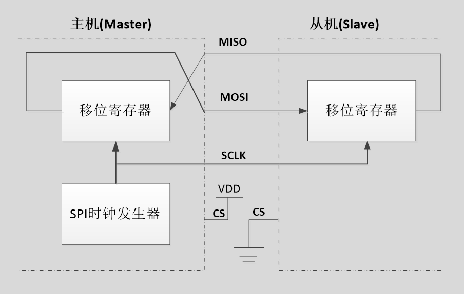
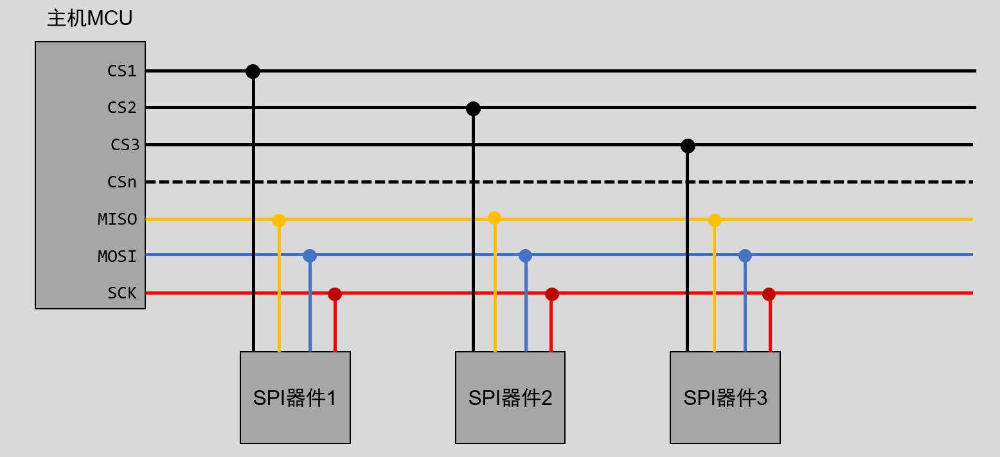
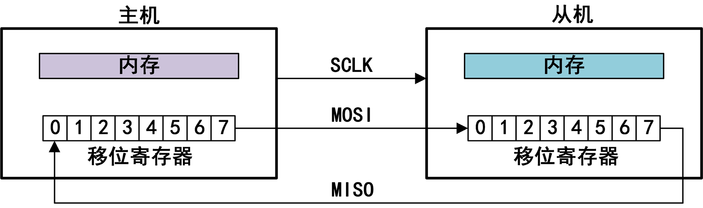
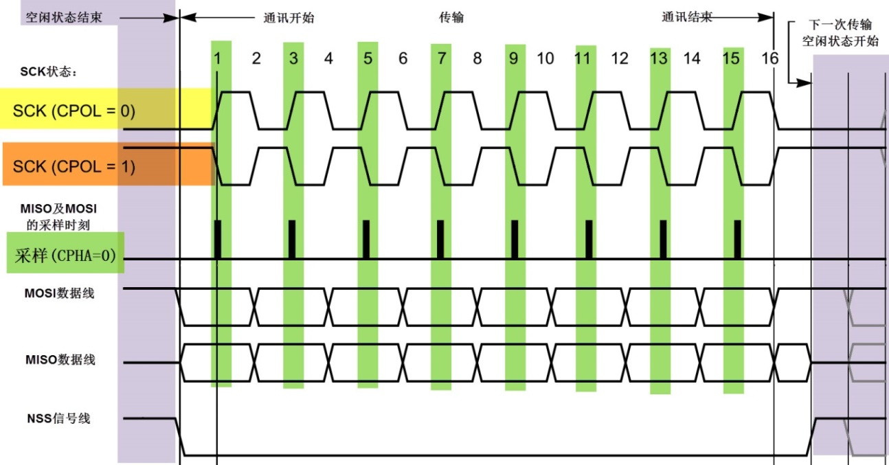
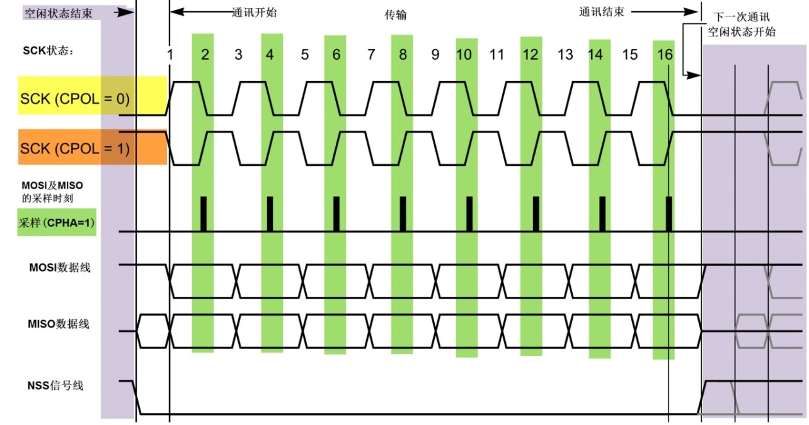

<!-- more -->

## 一、 SPI协议简介

### 1. 什么是SPI？

SPI 协议，Serial Peripheral Interface  ，即串行外围设备接口， 是由摩托罗拉公司提出的通讯协议（ Motorola） 在1980前后提出的一种全双工同步串行通信接口，它用于MCU与各种外围设备以串行方式进行通信以交换信息，通信速度最高可达25MHz以上。SPI接口主要应用在EEPROM、 FLASH、实时时钟、网络控制器、 OLED显示驱动器、 AD转换器，数字信号处理器、数字信号解码器等与MCU间要求通讯速率较高的场合 。

SPI，是一种**高速**的，**全双工**，**同步**的通信总线，并且在芯片的管脚上只占用四根线，节约了芯片的管脚，同时为PCB的布局上节省空间，提供方便，主要应用在 EEPROM，FLASH，实时时钟，AD转换器，还有数字信号处理器和数字信号解码器之间。

SPI 时钟频率相比 I2C 要高很多，最高可以工作在上百 MHz。 SPI 以主从方式工作，通常是有一个主设备和一个或多个从设备，一般 SPI 需要 4 根线，但是也可以使用三根线(单向传输) 。

### 2. 与I2C的对比

| 功能说明   | SPI总线                | I2C总线                  |
| ---------- | ---------------------- | ------------------------ |
| 通信方式   | 同步 串行 全双工       | 同步 串行 半双工         |
| 通信速度   | 一般50MHz以下          | 100KHz、 400KHz、 3.4MHz |
| 从设备选择 | 引脚片选               | 设备地址片选             |
| 总线接口   | MOSI、 MISO、 SCK、 CS | SDA、 SCL                |

SPI通常由四条线组成，一条主设备输出与从设备输入（ Master Output Slave Input， MOSI） ， 一条主设备输入与从设备输出（ Master Input Slave Output， MISO） ， 一条时钟信号（ Serial Clock， SCLK） ，一条从设备使能选择（ Chip Select， CS） 。 与I2C类似，协议都比较简单，也可以使用GPIO模拟SPI时序。

SPI可以同时发出和接收数据，因此SPI的理论传输速度比I2C更快。 SPI通过片选引脚选择从机，一个片选一个从机，因此在多从机结构中，需要占用较多引脚，而I2C通过设备地址选择从机，只要设备地址不冲突，始终只需要两个引脚。  

## 二、基本原理简介



- （1）SPI接口一般使用 4 条线通信：

| 接口名称 | 说明                           |
| -------- | ------------------------------ |
| MISO     | 主设备数据输入，从设备数据输出 |
| MOSI     | 主设备数据输出，从设备数据输入 |
| SCLK     | 时钟信号，由主设备产生         |
| CS       | 从设备片选信号，由主设备控制   |

- （2）主机和从机都有一个串行移位寄存器，主机通过向它的SPI串行寄存器写入一个字节来发起一次传输。
- （3）串行移位寄存器通过MOSI信号线将字节传送给从机，从机也将自己的串行移位寄存器中的内容通过MISO信号线返回给主机。这样，两个移位寄存器中的内容就被交换。
- （4）外设的写操作和读操作是同步完成的。如果只进行写操作，主机只需忽略接收到的字节；反之，若主机要读取从机的一个字节，就必须发送一个空字节来引发从机的传输。

## 三、设备连接

### 1. 物理拓扑结构

SPI通信设备之间常见的连接方式如下图：



- CS( Slave Select)：从设备选择信号线，常称为片选信号线，也称为NSS、CS，以下用CS表示。

当有多个SPI从设备与SPI主机相连时， 设备的其它信号线SCK、MOSI及MISO同时并联到相同的SPI总线上，即无论有多少个从设备，都共同只使用这3条总线； 而每个从设备都有独立的这一条CS信号线，本信号线独占主机的一个引脚，即有多少个从设备，就有多少条片选信号线。

I2C协议中通过设备地址来寻址、选中总线上的某个设备并与其进行通讯；而SPI协议中没有设备地址，它**使用CS信号线来寻址**， 当主机要选择从设备时，把该从设备的NSS信号线设置为低电平，该从设备即被选中，即片选有效， 接着主机开始与被选中的从设备进行SPI通讯。所以SPI通讯以CS线置低电平为开始信号，以CS线被拉高作为结束信号。

- SCK (Serial Clock)：时钟信号线，用于通讯数据同步

它由通讯主机产生，决定了通讯的速率，不同的设备支持的最高时钟频率不一样， 如STM32的SPI时钟频率最大为 fpclk/2 ，两个设备之间通讯时，通讯速率受限于低速设备。

- MOSI (Master Output， Slave Input)：主设备输出/从设备输入引脚。

主机的数据从这条信号线输出， 从机由这条信号线读入主机发送的数据，即这条线上数据的方向为主机到从机。

- MISO(Master Input,，Slave Output)：主设备输入/从设备输出引脚。

主机从这条信号线读入数据， 从机的数据由这条信号线输出到主机，即在这条线上数据的方向为从机到主机。

### 2. 数据交换

在SCK时钟周期的驱动下， MOSI和MISO同时进行，如下图所示，可以看作一个虚拟的环形拓扑结构。 



主机和从机都有一个移位寄存器，主机移位寄存器数据经过MOSI将数据写入从机的移位寄存器，此时从机移位寄存器的数据也通过MISO传给了主机，实现了两个移位寄存器的数据交换。无论主机还是从机，发送和接收都是同时进行的，如同一个“环”。如果主机只对从机进行写操作，主机只需忽略接收的从机数据即可。如果主机要读取从机数据，需要主机发送一个空数据来引发从机发送数据。  

## 四、SPI通信过程

### 1. 通信时序

这里的片选引脚用 NSS 表示了，它与CS是一个意思，前边有说明。


这是一个主机的通讯时序。NSS、SCK、MOSI信号都由主机控制产生，而MISO的信号由从机产生，主机通过该信号线读取从机的数据。 MOSI与MISO的信号只在NSS为低电平的时候才有效，在SCK的每个时钟周期MOSI和MISO传输一位数据。SPI通信**发送是先发高字节再发低字节，接收是先收高字节再收低字节**。

### 2. 起始与停止信号

SPI通信协议图中标号为 ① 和  ⑥ 的地方为起始和停止信号：

- **NSS信号线由高变低**，是SPI通讯的起始信号。NSS是每个从机各自独占的信号线， 当从机在自己的NSS线检测到起始信号后，就知道自己被主机选中了，开始准备与主机通讯。

- **NSS信号由低变高**， 是SPI通讯的停止信号，表示本次通讯结束，从机的选中状态被取消。

### 3. 数据传输

SPI使用MOSI及MISO信号线来传输数据，使用SCK信号线进行数据同步。MOSI及MISO数据线在SCK的**每个时钟周期传输一位数据**， 且数据**输入输出是同时进行**的。数据传输时，MSB先行或LSB先行并没有作硬性规定，但要保证两个SPI通讯设备之间使用同样的协定， 一般都会采用图 SPI通讯时序中的MSB先行模式。**SPI每次数据传输可以8位或16位为单位，每次传输的单位数不受限制**。

图中的 ②、③、④、⑤标号处，MOSI及MISO的数据在SCK的上升沿期间变化输出，在SCK的下降沿时被采样。即在SCK的下降沿时刻， MOSI及MISO的数据有效，高电平时表示数据“1”，为低电平时表示数据“0”。在其它时刻，数据无效，MOSI和MISO为下一次传输数据做准备。

### 4.四种通信模式

#### 4.1 CPOL与CPHA

SPI 有四种工作模式，通过串行时钟极性(CPOL)和相位(CPHA)的搭配来得到四种工作模式。

CPOL（ Clock Polarity，时钟极性） 表示SCK在空闲时（即SPI通讯开始前、 NSS线为高电平时SCK的状态）为高电平还是低电平。 当CPOL=0， SCK空闲时为低电平， 当CPOL=1， SCK空闲时为高电平。  

CPHA（ Clock Phase，时钟相位） 表示SCK在第几个时钟边缘采样数据。 当CPHA=0， 在SCK第一个边沿采样数据，当CPHA=1， 在SCK第二个边沿采样数据。  也可以这样理解，时钟相位CPHA是指数据的采样的时刻，当CPHA=0时， MOSI或MISO数据线上的信号将会在SCK时钟线的“奇数边沿”被采样。当CPHA=1时，数据线在SCK的“偶数边沿”采样。  这样搭配下来就会有四种模式：

- CPOL=0，串行时钟空闲状态为低电平。
- CPOL=1，串行时钟空闲状态为高电平，此时可以通过配置时钟相位(CPHA)来选择具体的传输协议。
- CPHA=0，串行时钟的第一个跳变沿(上升沿或下降沿)采集数据。
- CPHA=1，串行时钟的第二个跳变沿(上升沿或下降沿)采集数据。  

| SPI模式 | CPOL | CPHA | 空闲时SCK时钟 | 采样时刻 | 说明                                                       |
| :-----: | :--: | :--: | :-----------: | :------: | ---------------------------------------------------------- |
|    0    |  0   |  0   |    低电平     | 奇数边沿 | 时钟空闲状态为低电平； 在时钟第一个边沿（上升沿） 采样数据 |
|    1    |  0   |  1   |    低电平     | 偶数边沿 | 时钟空闲状态为低电平； 在时钟第二个边沿（下降沿） 采样数据 |
|    2    |  1   |  0   |    高电平     | 奇数边沿 | 时钟空闲状态为高电平； 在时钟第一个边沿（下降沿） 采样数据 |
|    3    |  1   |  1   |    高电平     | 偶数边沿 | 时钟空闲状态为高电平； 在时钟第二个边沿（上升沿） 采样数据 |

实际使用较多的是模式0和模式3。

#### 4.2 CPHA = 0



这是 CPHA=0 的时序图：

（1）首先，根据SCK在空闲状态时的电平，分为两种情况。 SCK信号线在空闲状态为低电平时，CPOL=0；空闲状态为高电平时，CPOL=1。

（2）无论CPOL=0还是1，由于我们配置的时钟相位CPHA=0，采样时刻都是在SCK的奇数边沿。 注意当CPOL=0的时候，时钟的奇数边沿是上升沿，而CPOL=1的时候，时钟的奇数边沿是下降沿，所以SPI的采样时刻不是由上升/下降沿决定的。 MOSI和MISO数据线的有效信号在SCK的奇数边沿保持不变，数据信号将在**SCK奇数边沿时被采样**，在非采样时刻，MOSI和MISO的有效信号才发生切换。

#### 4.3 CPHA = 1



（1）SCK信号线在空闲状态为低电平时， CPOL=0；空闲状态为高电平时， CPOL=1。  

（2）与CPHA=0类似，当CPHA=1时，不受CPOL的影响，数据信号在**SCK的偶数边沿被采样**。MOSI和MISO数据线的有效信号在SCK的偶数边沿保持不变，数据信
号将在SC**K偶数边沿时被采样**，在非采样时刻， MOSI和MISO的有效信号才发生切换。  

## 五、模拟SPI

我们已经了解了SPI的通信协议，那么我们接下来来了解一下如何用软件模拟SPI协议，以加深对SPI协议的理解。这里通过STM32驱动W25QXX为例，做基础的初始化和定义（基于HAL库），不过这里只实现SPI并不做对W25QXX读写的说明。

### 1. GPIO选择与引脚定义

#### 1.1 宏定义

首先定义SPI传输涉及的四个引脚PA4、 PA5、 PA6、 PA7， 其中MISO（ PA6）为输入引脚，其它全为输出引脚  

```c
#define SPIx                             SPI1
#define SPIx_CLK_ENABLE()                __HAL_RCC_SPI1_CLK_ENABLE()
#define SPIx_SCK_GPIO_CLK_ENABLE()       __HAL_RCC_GPIOA_CLK_ENABLE()
#define SPIx_MISO_GPIO_CLK_ENABLE()      __HAL_RCC_GPIOA_CLK_ENABLE() 
#define SPIx_MOSI_GPIO_CLK_ENABLE()      __HAL_RCC_GPIOA_CLK_ENABLE() 
#define W25_CS_GPIO_CLK_ENABLE()         __HAL_RCC_GPIOA_CLK_ENABLE() 

#define SPIx_FORCE_RESET()               __HAL_RCC_SPI1_FORCE_RESET()
#define SPIx_RELEASE_RESET()             __HAL_RCC_SPI1_RELEASE_RESET()

#define SPIx_SCK_PIN                     GPIO_PIN_5
#define SPIx_SCK_GPIO_PORT               GPIOA

#define SPIx_MISO_PIN                    GPIO_PIN_6
#define SPIx_MISO_GPIO_PORT              GPIOA

#define SPIx_MOSI_PIN                    GPIO_PIN_7
#define SPIx_MOSI_GPIO_PORT              GPIOA

#define W25_CS_PIN                       GPIO_PIN_4               
#define W25_CS_GPIO_PORT                 GPIOA    

#define SPI_CLK(level)                   HAL_GPIO_WritePin(SPIx_SCK_GPIO_PORT, SPIx_SCK_PIN, level?GPIO_PIN_SET:GPIO_PIN_RESET)                                    
#define SPI_MISO()                       HAL_GPIO_ReadPin(SPIx_MISO_GPIO_PORT, SPIx_MISO_PIN)
#define SPI_MOSI(level)                  HAL_GPIO_WritePin(SPIx_MOSI_GPIO_PORT, SPIx_MOSI_PIN, level?GPIO_PIN_SET:GPIO_PIN_RESET)
#define W25_CS(level)                    HAL_GPIO_WritePin(W25_CS_GPIO_PORT, W25_CS_PIN, level?GPIO_PIN_SET:GPIO_PIN_RESET)
```

#### 1.2 GPIO初始化

随后将四个GPIO引脚初始化，使能引脚时钟，设置输入/输出模式。 SCK、 MOSI、 CS引脚，始终为输出模式， MISO引脚为数据输入引脚， 始终为输入模式

```c
void SPI_Init(void)
{
    GPIO_InitTypeDef  GPIO_InitStruct;

    SPIx_SCK_GPIO_CLK_ENABLE();
    SPIx_MISO_GPIO_CLK_ENABLE();
    SPIx_MOSI_GPIO_CLK_ENABLE();
    W25_CS_GPIO_CLK_ENABLE();
    
    GPIO_InitStruct.Pin       = SPIx_SCK_PIN | W25_CS_PIN | SPIx_MOSI_PIN;
    GPIO_InitStruct.Mode      = GPIO_MODE_OUTPUT_PP;
    GPIO_InitStruct.Pull      = GPIO_PULLUP;
    GPIO_InitStruct.Speed     = GPIO_SPEED_FREQ_LOW;
    HAL_GPIO_Init(SPIx_SCK_GPIO_PORT, &GPIO_InitStruct); // SCK CS MOSI为输出
    
    GPIO_InitStruct.Pin       = SPIx_MISO_PIN;
    GPIO_InitStruct.Mode      = GPIO_MODE_INPUT;
    GPIO_InitStruct.Speed     = GPIO_SPEED_FREQ_LOW;
    HAL_GPIO_Init(SPIx_MISO_GPIO_PORT, &GPIO_InitStruct); // MISO为输入
    
    W25_CS(1);      // CS初始化高
    SPI_CLK(0);     // CLK初始化低
}
```

### 2. 延时函数定义

我们既然是模拟SPI，那么就需要手动产生时钟，所以这里当然就需要延时函数啦：

```c
#define SPI_Delay()     us_timer_delay(10)
```

定时器实现的延时函数，延时时间为 t us，为了缩短时间，这里这是演示，所以就不写具体实现了，具体的我们可以使用定时器来实现us级延时。

### 3. SPI读写函数

这里假设SPI主机工作在模式0，参考前面的SPI时序。

#### 3.1 写一个字节

```c
/*
 *  函数名：void SPI_WriteByte(uint8_t data)
 *  输入参数：data -> 要写的数据
 *  输出参数：无
 *  返回值：无
 *  函数作用：模拟SPI写一个字节
*/
void SPI_WriteByte(uint8_t data)
{
    uint8_t i = 0;
    uint8_t temp = 0;
    
    for(i=0; i<8; i++)
    {
        temp = ((data&0x80)==0x80)? 1:0; // 将data最高位保存到temp
        data = data<<1;       // data左移一位，将次高位变为最高位，用于下次取最高位；
        
        SPI_CLK(0);           // 拉低时钟，即空闲时钟为低电平， CPOL=0
        SPI_MOSI(temp);       // 根据temp值，设置MOSI引脚的电平
        SPI_Delay();          // 简单延时，可以定时器或延时函数实现
        SPI_CLK(1);           // 拉高时钟， W25Q64只支持SPI模式0或1，即会在时钟上升沿采样MOSI数据 CPHA=0
        SPI_Delay();    
    }
    SPI_CLK(0);              // 最后SPI发送完后，拉低时钟，进入空闲状态
}
```

第 13 - 23 行：SPI写1 Byte，循环8次，每次发送1 Bit。

#### 3.2 读一个字节

```c
/*
 *  函数名：uint8_t SPI_ReadByte(void)
 *  输入参数：
 *  输出参数：无
 *  返回值：读到的数据
 *  函数作用：模拟SPI读一个字节
*/
uint8_t SPI_ReadByte(void)
{
    uint8_t i = 0;
    uint8_t read_data = 0xFF;
    
    for(i=0; i<8; i++)
    {
        read_data = read_data << 1;  // “腾空” read_data 最低位， 8次循环后， read_data将高位在前
        
        SPI_CLK(0);    // 拉低时钟，即空闲时钟为低电平；
        SPI_Delay();
        SPI_CLK(1);    // 拉高时钟，此时从设备会发送数据，主机稍微延时一会，再读取MISO电平，得知传入数据
        SPI_Delay();
        if(SPI_MISO()==1)
        {
            read_data = read_data + 1;
        }
    }
    SPI_CLK(0);       // 最后SPI读取完后，拉低时钟，进入空闲状态
    return read_data;
}
```

第 13 - 25 行：SPI读1 Byte，循环8次，每次接收1 Bit。

#### 3.3 读写一个字节

SPI传输可以看作一个虚拟的环形拓扑结构，即输入和输出同时进行。在前面“ SPI_WriteByte()”函数里，发送了1 Byte，也应该接收1 Byte，只是代码中忽略了接收引脚MISO的状态； 在前面“ SPI_ReadByte()”函数里，接收了1 Byte，也应该发送1 Byte，只是代码中忽略了发送引脚MOSI的内容。有些场景， SPI需要同时读写，因此还需要编写SPI同时读写函数，  

```c
/*
 *  函数名：uint8_t SPI_WriteReadByte(uint8_t data)
 *  输入参数：pdata -> 要写的一个字节数据
 *  输出参数：无
 *  返回值：读到的数据
 *  函数作用：模拟SPI读写一个字节
*/
uint8_t SPI_WriteReadByte(uint8_t data)
{
    uint8_t i = 0;
    uint8_t temp = 0;
    uint8_t read_data = 0xFF;

    for(i=0;i<8;i++)
    {
        temp = ((data&0x80)==0x80)? 1:0; // 将data最高位保存到temp；
        data = data<<1;                  // data左移一位，将次高位变为最高位，用于下次取最高位；
        read_data = read_data<<1;        // “腾空” read_data最低位， 8次循环后， read_data将高位在前
        
        SPI_CLK(0);        // 拉低时钟，即空闲时钟为低电平；
        SPI_MOSI(temp);    // 根据temp值，设置MOSI引脚的电平
        SPI_Delay();       
        SPI_CLK(1);        // 拉高时钟，此时从设备会读取MOSI的数据，并写数据到MISO；
        SPI_Delay();
        if(SPI_MISO()==1)  // 读取MISO上的数据，保存到当前read_data最低位
        {
            read_data = read_data + 1;
        }
    }
    SPI_CLK(0);           // 最后SPI读写完后，拉低时钟，进入空闲状态；
    return read_data;
}
```

第14 - 31行： SPI读和写1 Byte，循环8次，每次发送和接收1 Bit 。
