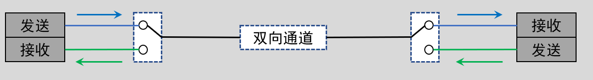

<!-- more -->

## 一、通信的两种方式

处理器与外部设备通信，按数据传送的方式，通讯可分为串行通讯与并行通讯，但是一般我们看到的大多数都是串行通信。

### 1.串行通信

串行通讯是指设备之间通过少量数据信号线(一般是 8 根以下)， 地线以及控制信号线，**按数据位形式一位一位地传输数据**的通讯方式。

- 传输原理：数据按位顺序传输

- 优点：占用处理器引脚资源少

- 缺点：传输速度相对较慢

### 2.并行通信

并行通讯一般是指使用 8、16、32 及 64 根或更多的数据线进行传输的通讯方式。

- 传输原理：数据各个位同时传输

- 优点：传输速度快

- 缺点：占用处理器引脚资源多

### 3.两种方式对比

| 特性       | 串行通信 | 并行通信 |
| ---------- | -------- | -------- |
| 通信距离   | 较远     | 较近     |
| 抗干扰能力 | 较强     | 较弱     |
| 传输速率   | 较慢     | 较快     |
| 成本       | 较低     | 较高     |

串行传输占用的通信线更少，成本低，通信速度相对较慢；并行传输占用的通信线多，成本高，通信速度相对更快。但随着对传输速度要求越来越高，并行传输开始出现信号之间的干扰，串行通信受干扰影响较小，之后又发展出差分传输等技术，极大的提高了串行传输速率，使得串行通信速度可能比并行通信速度更快。

串行通信就像单车道，行驶的车辆需要依次行驶。并行通信就像多车道，同时多辆汽车并排行驶。但当车速很快的时候，多车道上并列行驶的汽车之间会形成“气流”相互干扰，单车道则受影响较小，速度能够进一步提升。  

## 二、串行通信数据方向

在串行通信中，按照通信的方向，通信又分为全双工、半双工及单工通信。

### 1.单工通信

任何时刻，数据传输只支持数据在一个方向上传输，即一个固定为发送设备，另一个固定为接收设备。

例如收音机， 信息数据只能由广播站发送给收音机，单向不可逆的 。

### 2.半双工通信

数据可以在两个方向上传输，但是，**在某一时刻，只允许数据在一个方向上传输**，它实际上是一种可以切换方向的单工通信。

例如对讲机， 双向都可得到信息，但是同一时刻只能是一方发射另一方接收，发射和接收不能同时进行。

### 3.全双工通信

允许数据同时在两个方向上传输，因此，全双工通信是两个单工通信方式的结合，它要求发送设备和接收设备都有独立的接收和发送能力。

比如生活中的电话，全双工就像电话通信， 双方任意时刻都可以同时收发信息 。

## 三、串行通信方式

在串行通信中，数据在双方之间传输时，需要制定规则保证数据传输的准确。  根据通信过程中是否有使用到时钟信号进行区分，又分为同步和异步两种。

### 1.同步通信

在同步通讯中，收发设备双方会使用一根信号线表示时钟信号，在时钟信号的驱动下双方进行协调， 同步数据。 通讯中通常双方会统一规定在时钟信号的上升沿或下降沿对数据线进行采样。比如常见的SPI、 I2C。  

### 2.异步通信

在异步通讯中**不使用时钟信号进行数据同步**，它们直接在数据信号中**穿插一些同步用的信号位**，或者把主体数据进行打包， 以数据帧的格式传输数据，某些通讯中还需要双方约定数据的传输速率，以便更好地同步。比如UART、 1-Wire。  

### 3.两者比较

在同步通讯中，数据信号所传输的内容绝大部分就是有效数据，而异步通讯中会包含有帧的各种标识符，所以**同步通讯的效率更高**， 但是同步通讯双方的时钟允许误差较小，而**异步通讯双方的时钟允许误差较大**。

## 四、通信速率

### 1. 比特率与波特率

对于同步通信，通信速率由时钟信号决定，时钟信号越快，传输速度就越快。对于异步通信，需要收发双方提前统一通信速率，这也就是我们串口调试时，波特率不对显示乱码的原因。  

举个例子：假设发送端时钟频率为1Mhz，对应时钟周期则为1us, 接收端时钟频率为10Mhz，对应时钟周期则为0.1us。现在发送端发送一个数据0x1，就会产生一个持续时间为1us高电平，接收端接收到这个1us的高电平时，会当作是10个0.1us的高电平，认为收到了10个0x1。这时双方数据就乱套了，因此需要一个统一的时钟标准。  

通常使用比特率来描述通信速率的快慢 。**比特率**（ Bitrate） ： 系统在单位时间内传输的比特位（二进制0或1）个数，通常用Rb表示，单位是比特/秒（ bit/s），缩写为bps。

容易与比特率混淆的概念是“**波特率**”( Baudrate )，系统在单位时间内传输的码元个数，通常用RB表示，单位是波特（ Bd） 。100bit/s即是一秒钟传输100个0或1， 100Bd即是一秒钟传输100个码元。  

### 2. 码元

码元就是“ 承载信息量的基本信号单位”，以一条电线上传输的信号为例，码元就是电线上的电平值。如果电线上电平只有0和3.3V两种选择，传输的信号是这2种电平之一，码元的状态只有2种。接收方可以把0V认为是二进制的0，把3.3V认为是二进制1。即：传输1个码元时，能用来表示1位数据。此时波特率的大小与比特率一致。因为很多常见的通讯中一个码元都是表示两种状态，人们常常直接以波特率来表示比特率。

如果电线上电平有0V、 3.3V、 5V、 12V四种选择，传输的信号是这4种电平之一，码元的状态有4种。接收方可以把这4个电平认为是二级制的4个值： 00、 01、 10、 11。即：传输1个码元时，能用来表示2位数据，即两个二进制比特位。因此码元状态为4时，波特率的大小是比特率的一半，码元状态越多，每次传输的码元能携带的信息越多，自然速率也越高。 

码元有N个状态时，比特率与波特率的关系式 ：$R_b = R_B * log_2N$

## 五、常见的串行通信

在嵌入式中， 有众多通信协议， 往往从性能、成本、稳定性、 易用性等角度考虑选择合适的协议。  

| 通信接口 | 串行/并行 | 传输方向 | 同步/异步 | 电平标准 | 主从组成 | 引脚说明                                                     |
| -------- | --------- | -------- | --------- | -------- | -------- | ------------------------------------------------------------ |
| TTL      | 串行      | 全双工   | 异步      | 逻辑电平 | 一主一从 | 通过UART实现，TXD:发送端  RXD:接受端  GND:公共地             |
| RS232    | 串行      | 全双工   | 异步      | 逻辑电平 | 一主一从 | 通过UART实现，TXD:发送端  RXD:接受端  GND:公共地             |
| RS485    | 串行      | 半双工   | 异步      | 差分信号 | 一主多从 | 通过UART实现，TXD:发送端  RXD:接受端  GND:公共地             |
| USART    | 串行      | 全双工   | 同步      | 逻辑电平 | 一主一从 | ---                                                          |
| I2C      | 串行      | 半双工   | 同步      | 逻辑电平 | 一主多从 | SCL:同步时钟  SDA:数据输入/输出端                            |
| SPI      | 串行      | 全双工   | 同步      | 逻辑电平 | 一主多从 | SCK:同步时钟  MISO:主机输入，从机输出  MOSI:主机输出，从机输入 |
| CAN      | 串行      | 半双工   | 异步      | 差分信号 | 多主多从 | ---                                                          |
| 1-Wire   | 串行      | 半双工   | 异步      | 逻辑电平 | 一主多从 | 单总线，DQ:发送/接受端                                       |
| USB2.0   | 串行      | 半双工   | 异步      | 差分信号 | 一主多从 | ---                                                          |
